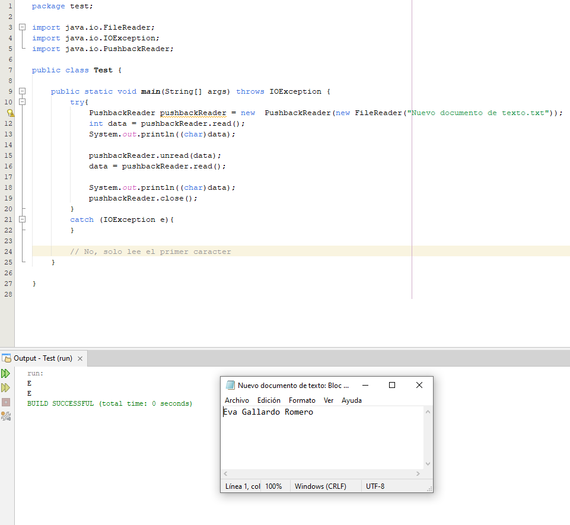
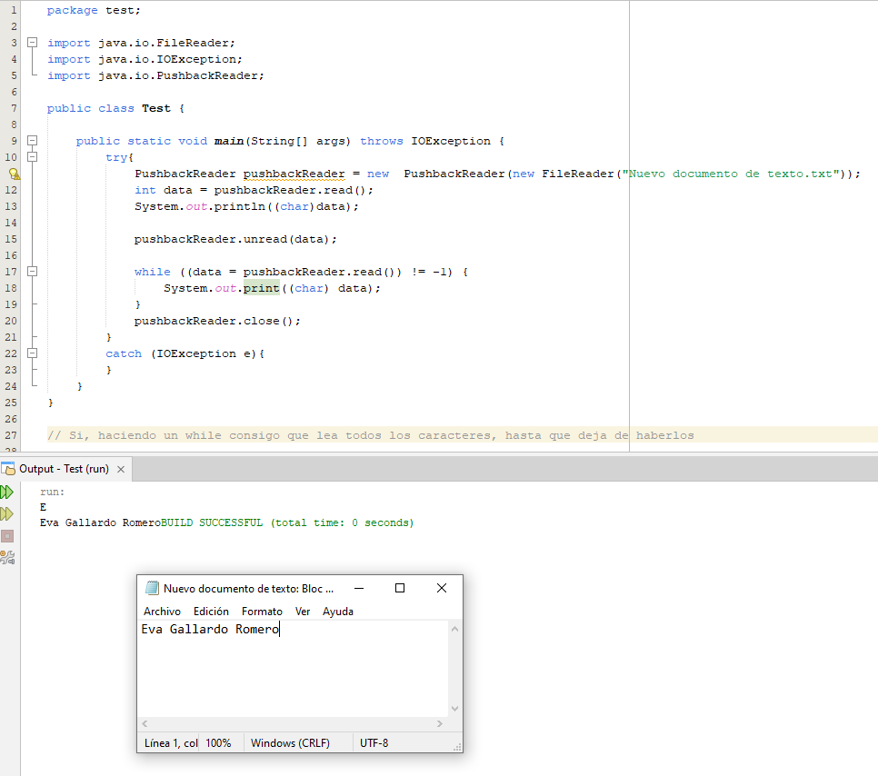
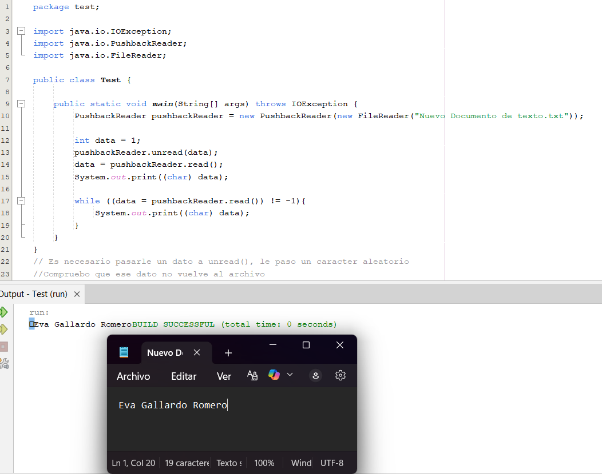
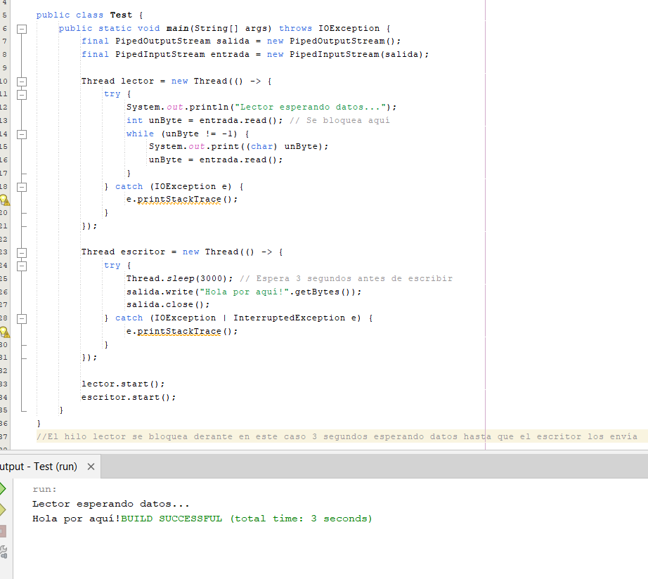
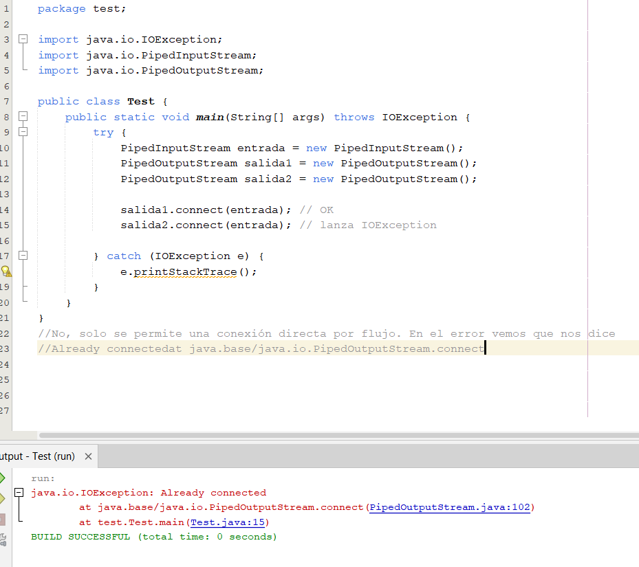
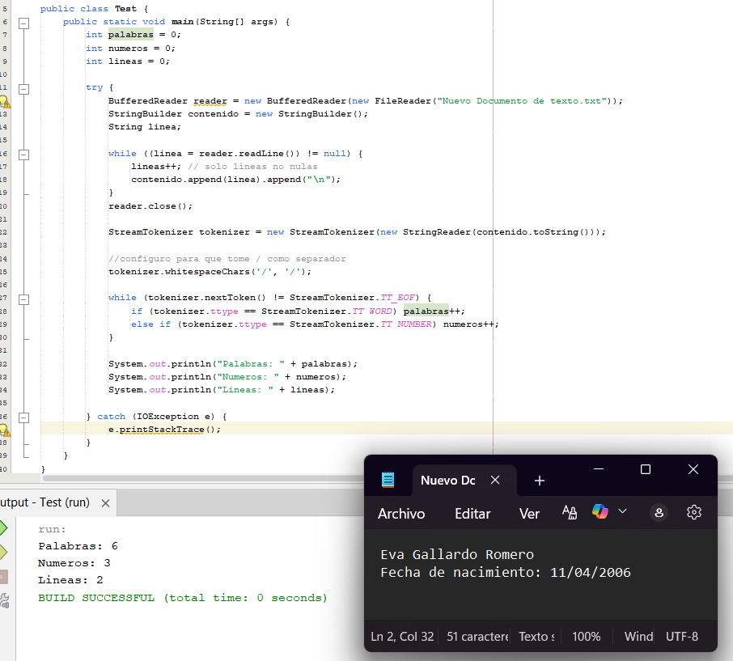
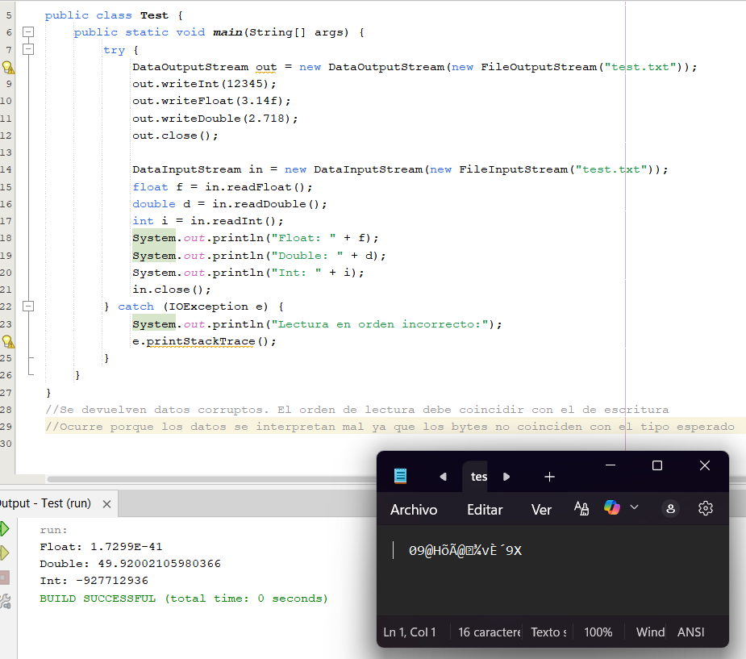
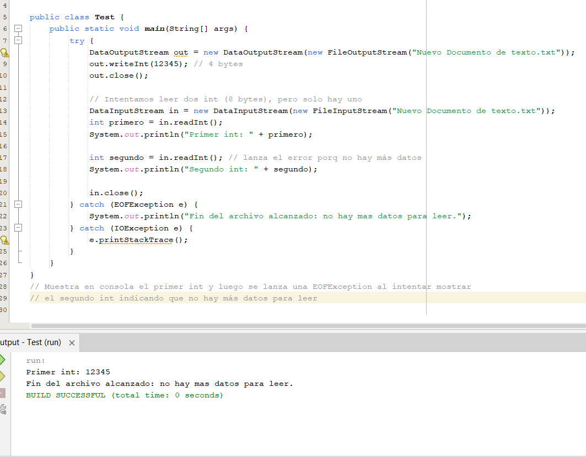

# PREGUNTAS TEMA 2
## 1. PushbackReader
Investigue las clases para el análisis de flujos de datos: PushBackReader. Concretamente investigue el comportamiento de los métodos: read y unread. Para ello, conteste a las siguientes preguntas, incluyendo las explicaciones y capturas de pantalla necesarias.
- ¿El uso de read modifica el archivo?
  
- Utilizando read, ¿puedo leer más de un carácter?
  
- ¿Qué ocurre si hago unread sin leer previamente un carácter?
  
## 2. PipedInputStream y PipedOutputStream
- ¿Qué ocurre si intentas leer antes de que se haya escrito nada?
  
- ¿Se puede conectar un PipedInputStream con varios PipedOutputStream?
  
## 3. StreamTokenizer y LineNumberReader
Crea un programa que lea un archivo de texto y cuente:
- Cuántas palabras tiene.
- Cuántos números aparecen.
- Cuántas líneas se procesaron.
  
## 4. DataInputStream
- ¿Qué ocurre si lees los datos en un orden distinto al que fueron escritos?
  
- ¿Qué pasa si intentas leer más bytes de los disponibles?
  
