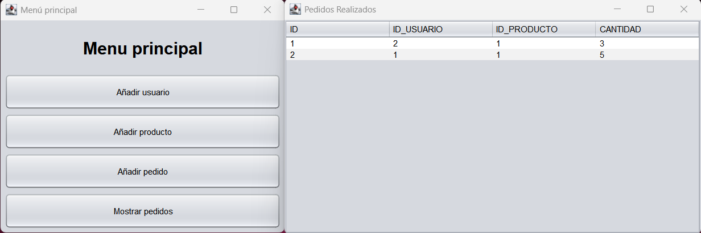
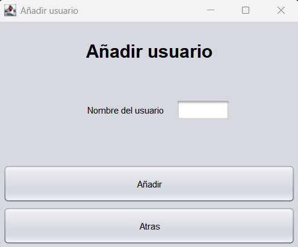
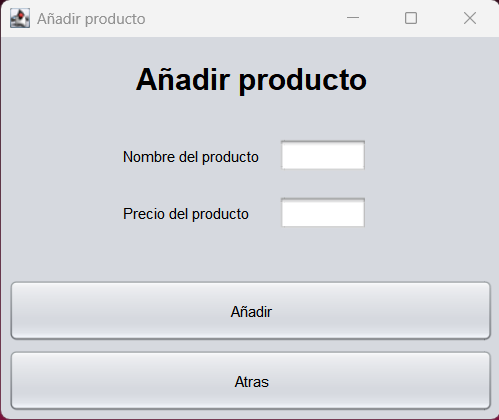
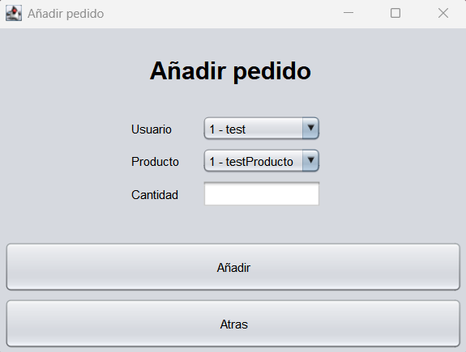

# Ejercicio
> **Nota:**  
> - **Comprobar que hay en el puerto 8080** -> ``` netstat -ano | findstr :8080 ```  
> - **Cortar proceso** -> ``` taskkill /PID <PID> /F ```

## application.properties
```
spring.application.name=practica5
spring.datasource.url=jdbc:h2:file:/data/practica5
spring.datasource.driverClassName=org.h2.Driver
spring.datasource.username=sa
spring.datasource.password=password
spring.jpa.database-platform=org.hibernate.dialect.H2Dialect
spring.h2.console.enabled=true
```
## data.sql
Incluya en el fichero “data.sql” las consultas de bases de datos para crear las siguientes
tablas:
### Tabla: usuarios

| Columna | Tipo            | Restricciones        |
|---------|------------------|-----------------------|
| id      | SERIAL           | PRIMARY KEY           |
| nombre  | VARCHAR(100)     | NOT NULL              |

### Tabla: productos

| Columna | Tipo            | Restricciones        |
|---------|------------------|-----------------------|
| id      | SERIAL           | PRIMARY KEY           |
| nombre  | VARCHAR(100)     | NOT NULL              |
| precio  | DECIMAL(10,2)    | NOT NULL              |

### Tabla: pedido

| Columna     | Tipo      | Restricciones                          |
|-------------|-----------|------------------------------------------|
| id          | SERIAL    | PRIMARY KEY                              |
| id_usuario  | INTEGER   | FOREIGN KEY → usuarios(id)               |
| id_producto | INTEGER   | FOREIGN KEY → productos(id)              |
| cantidad    | INTEGER   | NOT NULL                                 |

```sql
CREATE TABLE usuarios (
    id SERIAL PRIMARY KEY ,
    nombre VARCHAR(100) NOT NULL
);

CREATE TABLE productos (
    id SERIAL PRIMARY KEY,
    nombre VARCHAR(100) NOT NULL,
    precio DECIMAL(10,2) NOT NULL
);

CREATE TABLE pedido (
    id SERIAL PRIMARY KEY,
    id_usuario INTEGER REFERENCES usuarios(id),
    id_producto INTEGER REFERENCES productos(id),
    cantidad INTEGER NOT NULL
);
```

## ConexionBD.java
```java
package com.example.practica5;

import java.sql.Connection;
import java.sql.DriverManager;

public class ConexionBD {

    private static final String URL = "jdbc:h2:file:/data/practica5";
    private static final String USER = "sa";
    private static final String PASSWORD = "password";

    public static Connection getConnection() throws Exception {
        return DriverManager.getConnection(URL, USER, PASSWORD);
    }
}
```

## MenuPrincipal.java

```java
/*
 * Click nbfs://nbhost/SystemFileSystem/Templates/Licenses/license-default.txt to change this license
 * Click nbfs://nbhost/SystemFileSystem/Templates/GUIForms/JFrame.java to edit this template
 */
package com.example.practica5;

import java.sql.Connection;

/**
 *
 * @author evaga
 */
public class MenuPrincipal extends javax.swing.JFrame {
    
    private static final java.util.logging.Logger logger = java.util.logging.Logger.getLogger(MenuPrincipal.class.getName());

    /**
     * Creates new form MenuPrincipal
     */
    public MenuPrincipal() {
        initComponents();
        setTitle("Menú principal");
    }

    /**
     * This method is called from within the constructor to initialize the form.
     * WARNING: Do NOT modify this code. The content of this method is always
     * regenerated by the Form Editor.
     */
    @SuppressWarnings("unchecked")
    // <editor-fold defaultstate="collapsed" desc="Generated Code">                          
    private void initComponents() {

        anadirUsuario = new javax.swing.JButton();
        anadirProducto = new javax.swing.JButton();
        anadirPedido = new javax.swing.JButton();
        mostrarPedidos = new javax.swing.JButton();
        jLabel1 = new javax.swing.JLabel();

        setDefaultCloseOperation(javax.swing.WindowConstants.EXIT_ON_CLOSE);

        anadirUsuario.setText("Añadir usuario");
        anadirUsuario.addActionListener(new java.awt.event.ActionListener() {
            public void actionPerformed(java.awt.event.ActionEvent evt) {
                anadirUsuarioActionPerformed(evt);
            }
        });

        anadirProducto.setText("Añadir producto");
        anadirProducto.addActionListener(new java.awt.event.ActionListener() {
            public void actionPerformed(java.awt.event.ActionEvent evt) {
                anadirProductoActionPerformed(evt);
            }
        });

        anadirPedido.setText("Añadir pedido");

        mostrarPedidos.setText("Mostrar pedidos");
        mostrarPedidos.addActionListener(new java.awt.event.ActionListener() {
            public void actionPerformed(java.awt.event.ActionEvent evt) {
                mostrarPedidosActionPerformed(evt);
            }
        });

        jLabel1.setFont(new java.awt.Font("SansSerif", 1, 24)); // NOI18N
        jLabel1.setHorizontalAlignment(javax.swing.SwingConstants.CENTER);
        jLabel1.setText("Menu principal");
        jLabel1.setAlignmentY(0.0F);

        javax.swing.GroupLayout layout = new javax.swing.GroupLayout(getContentPane());
        getContentPane().setLayout(layout);
        layout.setHorizontalGroup(
            layout.createParallelGroup(javax.swing.GroupLayout.Alignment.LEADING)
            .addGroup(layout.createSequentialGroup()
                .addContainerGap()
                .addGroup(layout.createParallelGroup(javax.swing.GroupLayout.Alignment.LEADING)
                    .addComponent(anadirUsuario, javax.swing.GroupLayout.DEFAULT_SIZE, javax.swing.GroupLayout.DEFAULT_SIZE, Short.MAX_VALUE)
                    .addComponent(anadirProducto, javax.swing.GroupLayout.DEFAULT_SIZE, javax.swing.GroupLayout.DEFAULT_SIZE, Short.MAX_VALUE)
                    .addComponent(anadirPedido, javax.swing.GroupLayout.DEFAULT_SIZE, javax.swing.GroupLayout.DEFAULT_SIZE, Short.MAX_VALUE)
                    .addComponent(mostrarPedidos, javax.swing.GroupLayout.DEFAULT_SIZE, javax.swing.GroupLayout.DEFAULT_SIZE, Short.MAX_VALUE))
                .addContainerGap())
            .addComponent(jLabel1, javax.swing.GroupLayout.DEFAULT_SIZE, 400, Short.MAX_VALUE)
        );
        layout.setVerticalGroup(
            layout.createParallelGroup(javax.swing.GroupLayout.Alignment.LEADING)
            .addGroup(layout.createSequentialGroup()
                .addGap(23, 23, 23)
                .addComponent(jLabel1)
                .addPreferredGap(javax.swing.LayoutStyle.ComponentPlacement.RELATED, 21, Short.MAX_VALUE)
                .addComponent(anadirUsuario, javax.swing.GroupLayout.PREFERRED_SIZE, 50, javax.swing.GroupLayout.PREFERRED_SIZE)
                .addPreferredGap(javax.swing.LayoutStyle.ComponentPlacement.RELATED)
                .addComponent(anadirProducto, javax.swing.GroupLayout.PREFERRED_SIZE, 50, javax.swing.GroupLayout.PREFERRED_SIZE)
                .addPreferredGap(javax.swing.LayoutStyle.ComponentPlacement.RELATED)
                .addComponent(anadirPedido, javax.swing.GroupLayout.PREFERRED_SIZE, 50, javax.swing.GroupLayout.PREFERRED_SIZE)
                .addPreferredGap(javax.swing.LayoutStyle.ComponentPlacement.RELATED)
                .addComponent(mostrarPedidos, javax.swing.GroupLayout.PREFERRED_SIZE, 50, javax.swing.GroupLayout.PREFERRED_SIZE)
                .addContainerGap())
        );

        pack();
    }// </editor-fold>                        

    private void anadirProductoActionPerformed(java.awt.event.ActionEvent evt) {                                               
        // TODO add your handling code here:
    }                                              

    private void mostrarPedidosActionPerformed(java.awt.event.ActionEvent evt) {                                               
        
        // Crear ventana para mostrar pedidos
        javax.swing.JFrame pedidosFrame = new javax.swing.JFrame("Pedidos Realizados"); 
        pedidosFrame.setDefaultCloseOperation(javax.swing.JFrame.DISPOSE_ON_CLOSE);
        pedidosFrame.setSize(600, 400); // Tamaño de la ventana 
        

        // Panel principal con BorderLayout para colocar la tabla en el centro
        javax.swing.JPanel panel = new javax.swing.JPanel(new java.awt.BorderLayout());
        
        try {
            Connection conn = ConexionBD.getConnection();

            // Consulta SQL muestra todos los pedidos
            java.sql.Statement stmt = conn.createStatement();
            java.sql.ResultSet rs = stmt.executeQuery("SELECT * FROM pedido");

            // Modelo de tabla dinámico
            javax.swing.table.DefaultTableModel model = new javax.swing.table.DefaultTableModel();
            // Obtener nombres de columnas
            java.sql.ResultSetMetaData meta = rs.getMetaData();
            int colCount = meta.getColumnCount();

            // Añadir nombres de columnas al modelo
            for (int i = 1; i <= colCount; i++) {
                model.addColumn(meta.getColumnName(i));
            }

            // Recorrer cada fila del ResultSet y añadirla al modelo
            while (rs.next()) {
                Object[] row = new Object[colCount];
                for (int i = 0; i < colCount; i++) {
                    row[i] = rs.getObject(i + 1);
                }
                model.addRow(row);
            }

            // Crear tabla Swing con el modelo generado
            javax.swing.JTable table = new javax.swing.JTable(model);
            panel.add(new javax.swing.JScrollPane(table), java.awt.BorderLayout.CENTER);

            rs.close();
            stmt.close();
            conn.close();

        } catch (Exception ex) {
            ex.printStackTrace();
        }

        pedidosFrame.setContentPane(panel);
        pedidosFrame.setVisible(true);
    

    }                                              

    private void anadirUsuarioActionPerformed(java.awt.event.ActionEvent evt) {                                              
        // TODO add your handling code here:
    }                                             

    /**
     * @param args the command line arguments
     */
    public static void main(String args[]) {
        /* Set the Nimbus look and feel */
        //<editor-fold defaultstate="collapsed" desc=" Look and feel setting code (optional) ">
        /* If Nimbus (introduced in Java SE 6) is not available, stay with the default look and feel.
         * For details see http://download.oracle.com/javase/tutorial/uiswing/lookandfeel/plaf.html 
         */
        try {
            for (javax.swing.UIManager.LookAndFeelInfo info : javax.swing.UIManager.getInstalledLookAndFeels()) {
                if ("Nimbus".equals(info.getName())) {
                    javax.swing.UIManager.setLookAndFeel(info.getClassName());
                    break;
                }
            }
        } catch (ReflectiveOperationException | javax.swing.UnsupportedLookAndFeelException ex) {
            logger.log(java.util.logging.Level.SEVERE, null, ex);
        }
        //</editor-fold>

        /* Create and display the form */
        java.awt.EventQueue.invokeLater(() -> new MenuPrincipal().setVisible(true));
    }

    // Variables declaration - do not modify                     
    private javax.swing.JButton anadirPedido;
    private javax.swing.JButton anadirProducto;
    private javax.swing.JButton anadirUsuario;
    private javax.swing.JLabel jLabel1;
    private javax.swing.JButton mostrarPedidos;
    // End of variables declaration                   
}
```

## AnadirUsuario.java

```java
/*
 * Click nbfs://nbhost/SystemFileSystem/Templates/Licenses/license-default.txt to change this license
 * Click nbfs://nbhost/SystemFileSystem/Templates/GUIForms/JFrame.java to edit this template
 */
package com.example.practica5;

import java.sql.Connection;
import java.sql.DriverManager;
import java.sql.PreparedStatement;

/**
 *
 * @author evaga
 */
public class AnadirUsuario extends javax.swing.JFrame {
    
    private static final java.util.logging.Logger logger = java.util.logging.Logger.getLogger(AnadirUsuario.class.getName());

    /**
     * Creates new form AnadirUsuario
     */
    public AnadirUsuario() {
        initComponents();
        setTitle("Añadir usuario");
        TextFieldNombre.setText("Ej: PEPE");
    }

    /**
     * This method is called from within the constructor to initialize the form.
     * WARNING: Do NOT modify this code. The content of this method is always
     * regenerated by the Form Editor.
     */
    @SuppressWarnings("unchecked")
    // <editor-fold defaultstate="collapsed" desc="Generated Code">                          
    private void initComponents() {

        tituloAnadirUsuario = new javax.swing.JLabel();
        TextFieldNombre = new javax.swing.JTextField();
        btnAnadir = new javax.swing.JButton();
        btnAtras = new javax.swing.JButton();
        jLabel1 = new javax.swing.JLabel();

        setDefaultCloseOperation(javax.swing.WindowConstants.EXIT_ON_CLOSE);

        tituloAnadirUsuario.setText("Nombre del usuario");

        TextFieldNombre.addActionListener(new java.awt.event.ActionListener() {
            public void actionPerformed(java.awt.event.ActionEvent evt) {
                TextFieldNombreActionPerformed(evt);
            }
        });

        btnAnadir.setText("Añadir");
        btnAnadir.addActionListener(new java.awt.event.ActionListener() {
            public void actionPerformed(java.awt.event.ActionEvent evt) {
                btnAnadirActionPerformed(evt);
            }
        });

        btnAtras.setText("Atras");

        jLabel1.setFont(new java.awt.Font("SansSerif", 1, 24)); // NOI18N
        jLabel1.setHorizontalAlignment(javax.swing.SwingConstants.CENTER);
        jLabel1.setText("Añadir usuario");
        jLabel1.setAlignmentY(0.0F);

        javax.swing.GroupLayout layout = new javax.swing.GroupLayout(getContentPane());
        getContentPane().setLayout(layout);
        layout.setHorizontalGroup(
            layout.createParallelGroup(javax.swing.GroupLayout.Alignment.LEADING)
            .addGroup(layout.createSequentialGroup()
                .addContainerGap()
                .addGroup(layout.createParallelGroup(javax.swing.GroupLayout.Alignment.LEADING)
                    .addComponent(btnAtras, javax.swing.GroupLayout.DEFAULT_SIZE, javax.swing.GroupLayout.DEFAULT_SIZE, Short.MAX_VALUE)
                    .addComponent(btnAnadir, javax.swing.GroupLayout.DEFAULT_SIZE, javax.swing.GroupLayout.DEFAULT_SIZE, Short.MAX_VALUE)
                    .addGroup(layout.createSequentialGroup()
                        .addGap(112, 112, 112)
                        .addComponent(tituloAnadirUsuario, javax.swing.GroupLayout.PREFERRED_SIZE, 112, javax.swing.GroupLayout.PREFERRED_SIZE)
                        .addPreferredGap(javax.swing.LayoutStyle.ComponentPlacement.RELATED)
                        .addComponent(TextFieldNombre, javax.swing.GroupLayout.PREFERRED_SIZE, 71, javax.swing.GroupLayout.PREFERRED_SIZE)
                        .addGap(0, 87, Short.MAX_VALUE)))
                .addContainerGap())
            .addComponent(jLabel1, javax.swing.GroupLayout.Alignment.TRAILING, javax.swing.GroupLayout.DEFAULT_SIZE, javax.swing.GroupLayout.DEFAULT_SIZE, Short.MAX_VALUE)
        );
        layout.setVerticalGroup(
            layout.createParallelGroup(javax.swing.GroupLayout.Alignment.LEADING)
            .addGroup(layout.createSequentialGroup()
                .addGap(23, 23, 23)
                .addComponent(jLabel1)
                .addGap(49, 49, 49)
                .addGroup(layout.createParallelGroup(javax.swing.GroupLayout.Alignment.BASELINE)
                    .addComponent(tituloAnadirUsuario, javax.swing.GroupLayout.PREFERRED_SIZE, 25, javax.swing.GroupLayout.PREFERRED_SIZE)
                    .addComponent(TextFieldNombre, javax.swing.GroupLayout.PREFERRED_SIZE, javax.swing.GroupLayout.DEFAULT_SIZE, javax.swing.GroupLayout.PREFERRED_SIZE))
                .addPreferredGap(javax.swing.LayoutStyle.ComponentPlacement.RELATED, 59, Short.MAX_VALUE)
                .addComponent(btnAnadir, javax.swing.GroupLayout.PREFERRED_SIZE, 50, javax.swing.GroupLayout.PREFERRED_SIZE)
                .addPreferredGap(javax.swing.LayoutStyle.ComponentPlacement.RELATED)
                .addComponent(btnAtras, javax.swing.GroupLayout.PREFERRED_SIZE, 50, javax.swing.GroupLayout.PREFERRED_SIZE)
                .addContainerGap())
        );

        pack();
    }// </editor-fold>                        

    private void btnAnadirActionPerformed(java.awt.event.ActionEvent evt) {                                          
        
        String nombre = TextFieldNombre.getText();

        if (!nombre.trim().isEmpty()) {

            try {
                // Abrir conexión con la base de datos 
                Connection conn = ConexionBD.getConnection();

                // Consulta SQL
                String sql = "INSERT INTO usuarios (nombre) VALUES (?)";
                PreparedStatement pstmt = conn.prepareStatement(sql);

                // Asignar valor
                pstmt.setString(1, nombre);

                // Ejecutar inserción
                int filas = pstmt.executeUpdate();

                // Comprobar resultado
                if (filas > 0) {
                    System.out.println("Se inserto correctamente");
                    TextFieldNombre.setText("");
                } else {
                    System.out.println("No se pudo insertar");
                }

                // Cerrar conexión
                conn.close();

            } catch (Exception ex) {
                System.out.println("Error: " + ex);
                ex.printStackTrace();
            }
        }else{
            System.out.println("El nombre no puede estar vacios");
        }

    }                                         

    private void TextFieldNombreActionPerformed(java.awt.event.ActionEvent evt) {                                                
        // TODO add your handling code here:
    }                                               

    /**
     * @param args the command line arguments
     */
    public static void main(String args[]) {
        /* Set the Nimbus look and feel */
        //<editor-fold defaultstate="collapsed" desc=" Look and feel setting code (optional) ">
        /* If Nimbus (introduced in Java SE 6) is not available, stay with the default look and feel.
         * For details see http://download.oracle.com/javase/tutorial/uiswing/lookandfeel/plaf.html 
         */
        try {
            for (javax.swing.UIManager.LookAndFeelInfo info : javax.swing.UIManager.getInstalledLookAndFeels()) {
                if ("Nimbus".equals(info.getName())) {
                    javax.swing.UIManager.setLookAndFeel(info.getClassName());
                    break;
                }
            }
        } catch (ReflectiveOperationException | javax.swing.UnsupportedLookAndFeelException ex) {
            logger.log(java.util.logging.Level.SEVERE, null, ex);
        }
        //</editor-fold>

        /* Create and display the form */
        java.awt.EventQueue.invokeLater(() -> new AnadirUsuario().setVisible(true));
    }

    // Variables declaration - do not modify                     
    private javax.swing.JTextField TextFieldNombre;
    private javax.swing.JButton btnAnadir;
    private javax.swing.JButton btnAtras;
    private javax.swing.JLabel jLabel1;
    private javax.swing.JLabel tituloAnadirUsuario;
    // End of variables declaration                   
}
```

## AnadirProducto.java

```java
/*
 * Click nbfs://nbhost/SystemFileSystem/Templates/Licenses/license-default.txt to change this license
 * Click nbfs://nbhost/SystemFileSystem/Templates/GUIForms/JFrame.java to edit this template
 */
package com.example.practica5;

import java.sql.Connection;

/**
 *
 * @author evaga
 */
public class AnadirProducto extends javax.swing.JFrame {
    
    private static final java.util.logging.Logger logger = java.util.logging.Logger.getLogger(AnadirProducto.class.getName());

    /**
     * Creates new form AnadirProducto
     */
    public AnadirProducto() {
        initComponents();
        setTitle("Añadir producto");
    }

    /**
     * This method is called from within the constructor to initialize the form.
     * WARNING: Do NOT modify this code. The content of this method is always
     * regenerated by the Form Editor.
     */
    @SuppressWarnings("unchecked")
    // <editor-fold defaultstate="collapsed" desc="Generated Code">                          
    private void initComponents() {

        btnAtras = new javax.swing.JButton();
        tituloAnadirProducto = new javax.swing.JLabel();
        textFieldNombreProducto = new javax.swing.JTextField();
        btnAnadir = new javax.swing.JButton();
        tituloPrecioProducto = new javax.swing.JLabel();
        textFieldPrecioProducto = new javax.swing.JTextField();
        jLabel1 = new javax.swing.JLabel();

        setDefaultCloseOperation(javax.swing.WindowConstants.EXIT_ON_CLOSE);

        btnAtras.setText("Atras");

        tituloAnadirProducto.setText("Nombre del producto");

        textFieldNombreProducto.addActionListener(new java.awt.event.ActionListener() {
            public void actionPerformed(java.awt.event.ActionEvent evt) {
                textFieldNombreProductoActionPerformed(evt);
            }
        });

        btnAnadir.setText("Añadir");
        btnAnadir.addActionListener(new java.awt.event.ActionListener() {
            public void actionPerformed(java.awt.event.ActionEvent evt) {
                btnAnadirActionPerformed(evt);
            }
        });

        tituloPrecioProducto.setText("Precio del producto");

        jLabel1.setFont(new java.awt.Font("SansSerif", 1, 24)); // NOI18N
        jLabel1.setHorizontalAlignment(javax.swing.SwingConstants.CENTER);
        jLabel1.setText("Añadir producto");
        jLabel1.setAlignmentY(0.0F);

        javax.swing.GroupLayout layout = new javax.swing.GroupLayout(getContentPane());
        getContentPane().setLayout(layout);
        layout.setHorizontalGroup(
            layout.createParallelGroup(javax.swing.GroupLayout.Alignment.LEADING)
            .addGroup(layout.createSequentialGroup()
                .addContainerGap(98, Short.MAX_VALUE)
                .addGroup(layout.createParallelGroup(javax.swing.GroupLayout.Alignment.LEADING)
                    .addGroup(layout.createSequentialGroup()
                        .addComponent(tituloPrecioProducto, javax.swing.GroupLayout.PREFERRED_SIZE, 118, javax.swing.GroupLayout.PREFERRED_SIZE)
                        .addPreferredGap(javax.swing.LayoutStyle.ComponentPlacement.RELATED)
                        .addComponent(textFieldPrecioProducto, javax.swing.GroupLayout.PREFERRED_SIZE, 71, javax.swing.GroupLayout.PREFERRED_SIZE))
                    .addGroup(layout.createSequentialGroup()
                        .addComponent(tituloAnadirProducto, javax.swing.GroupLayout.PREFERRED_SIZE, 118, javax.swing.GroupLayout.PREFERRED_SIZE)
                        .addPreferredGap(javax.swing.LayoutStyle.ComponentPlacement.RELATED)
                        .addComponent(textFieldNombreProducto, javax.swing.GroupLayout.PREFERRED_SIZE, 71, javax.swing.GroupLayout.PREFERRED_SIZE)))
                .addGap(107, 107, 107))
            .addGroup(javax.swing.GroupLayout.Alignment.TRAILING, layout.createSequentialGroup()
                .addContainerGap()
                .addGroup(layout.createParallelGroup(javax.swing.GroupLayout.Alignment.TRAILING)
                    .addComponent(btnAtras, javax.swing.GroupLayout.DEFAULT_SIZE, javax.swing.GroupLayout.DEFAULT_SIZE, Short.MAX_VALUE)
                    .addComponent(btnAnadir, javax.swing.GroupLayout.DEFAULT_SIZE, javax.swing.GroupLayout.DEFAULT_SIZE, Short.MAX_VALUE))
                .addContainerGap())
            .addComponent(jLabel1, javax.swing.GroupLayout.DEFAULT_SIZE, javax.swing.GroupLayout.DEFAULT_SIZE, Short.MAX_VALUE)
        );
        layout.setVerticalGroup(
            layout.createParallelGroup(javax.swing.GroupLayout.Alignment.LEADING)
            .addGroup(layout.createSequentialGroup()
                .addGap(18, 18, 18)
                .addComponent(jLabel1)
                .addGap(31, 31, 31)
                .addGroup(layout.createParallelGroup(javax.swing.GroupLayout.Alignment.BASELINE)
                    .addComponent(textFieldNombreProducto, javax.swing.GroupLayout.PREFERRED_SIZE, javax.swing.GroupLayout.DEFAULT_SIZE, javax.swing.GroupLayout.PREFERRED_SIZE)
                    .addComponent(tituloAnadirProducto, javax.swing.GroupLayout.PREFERRED_SIZE, 25, javax.swing.GroupLayout.PREFERRED_SIZE))
                .addGap(18, 18, 18)
                .addGroup(layout.createParallelGroup(javax.swing.GroupLayout.Alignment.BASELINE)
                    .addComponent(tituloPrecioProducto, javax.swing.GroupLayout.PREFERRED_SIZE, 25, javax.swing.GroupLayout.PREFERRED_SIZE)
                    .addComponent(textFieldPrecioProducto, javax.swing.GroupLayout.PREFERRED_SIZE, javax.swing.GroupLayout.DEFAULT_SIZE, javax.swing.GroupLayout.PREFERRED_SIZE))
                .addPreferredGap(javax.swing.LayoutStyle.ComponentPlacement.RELATED, 39, Short.MAX_VALUE)
                .addComponent(btnAnadir, javax.swing.GroupLayout.PREFERRED_SIZE, 50, javax.swing.GroupLayout.PREFERRED_SIZE)
                .addPreferredGap(javax.swing.LayoutStyle.ComponentPlacement.RELATED)
                .addComponent(btnAtras, javax.swing.GroupLayout.PREFERRED_SIZE, 50, javax.swing.GroupLayout.PREFERRED_SIZE)
                .addContainerGap())
        );

        pack();
    }// </editor-fold>                        

    private void btnAnadirActionPerformed(java.awt.event.ActionEvent evt) {                                          
        
        String nombre = textFieldNombreProducto.getText();
        String precioTexto = textFieldPrecioProducto.getText();

        // PRIMERA VALIDACIÓN: comprobar que los campos no están vacíos
        if (nombre.trim().isEmpty() || precioTexto.trim().isEmpty()) {
            System.out.println("El nombre y el precio no pueden estar vacios");
            return;
        }

        // SEGUNDA VALIDACIÓN: comprobar que el precio es un número
        double precio;
        try {
            precio = Double.parseDouble(precioTexto);
        } catch (NumberFormatException e) {
            System.out.println("El precio debe ser un numero valido");
            return;
        }

        try {
            Connection conn = ConexionBD.getConnection();

            String sql = "INSERT INTO productos (nombre, precio) VALUES (?, ?)";
            java.sql.PreparedStatement pstmt = conn.prepareStatement(sql);

            pstmt.setString(1, nombre);
            pstmt.setDouble(2, precio);

            int filas = pstmt.executeUpdate();

            if (filas > 0) {
                System.out.println("Producto insertado correctamente");
                textFieldNombreProducto.setText("");
                textFieldPrecioProducto.setText("");

            } else {
                System.out.println("No se pudo insertar el producto");
            }

            pstmt.close();
            conn.close();

        } catch (Exception ex) {
            ex.printStackTrace();
        }
    

    }                                         

    private void textFieldNombreProductoActionPerformed(java.awt.event.ActionEvent evt) {                                                        
        // TODO add your handling code here:
    }                                                       

    /**
     * @param args the command line arguments
     */
    public static void main(String args[]) {
        /* Set the Nimbus look and feel */
        //<editor-fold defaultstate="collapsed" desc=" Look and feel setting code (optional) ">
        /* If Nimbus (introduced in Java SE 6) is not available, stay with the default look and feel.
         * For details see http://download.oracle.com/javase/tutorial/uiswing/lookandfeel/plaf.html 
         */
        try {
            for (javax.swing.UIManager.LookAndFeelInfo info : javax.swing.UIManager.getInstalledLookAndFeels()) {
                if ("Nimbus".equals(info.getName())) {
                    javax.swing.UIManager.setLookAndFeel(info.getClassName());
                    break;
                }
            }
        } catch (ReflectiveOperationException | javax.swing.UnsupportedLookAndFeelException ex) {
            logger.log(java.util.logging.Level.SEVERE, null, ex);
        }
        //</editor-fold>

        /* Create and display the form */
        java.awt.EventQueue.invokeLater(() -> new AnadirProducto().setVisible(true));
    }

    // Variables declaration - do not modify                     
    private javax.swing.JButton btnAnadir;
    private javax.swing.JButton btnAtras;
    private javax.swing.JLabel jLabel1;
    private javax.swing.JTextField textFieldNombreProducto;
    private javax.swing.JTextField textFieldPrecioProducto;
    private javax.swing.JLabel tituloAnadirProducto;
    private javax.swing.JLabel tituloPrecioProducto;
    // End of variables declaration                   
}
```

## AnadirPedido.java

```java
/*
 * Click nbfs://nbhost/SystemFileSystem/Templates/Licenses/license-default.txt to change this license
 * Click nbfs://nbhost/SystemFileSystem/Templates/GUIForms/JFrame.java to edit this template
 */
package com.example.practica5;

import java.sql.Connection;

/**
 *
 * @author evaga
 */
public class AnadirPedido extends javax.swing.JFrame {
    
    private static final java.util.logging.Logger logger = java.util.logging.Logger.getLogger(AnadirPedido.class.getName());

    /**
     * Creates new form AnadirPedido
     */
    public AnadirPedido() {
        initComponents();
        cargarUsuarios();
        cargarProductos();
        setTitle("Añadir pedido");
    }
    
    private void cargarUsuarios() {
        try {
            Connection conn = ConexionBD.getConnection();

            String sql = "SELECT id, nombre FROM usuarios";
            java.sql.PreparedStatement stmt = conn.prepareStatement(sql);
            java.sql.ResultSet rs = stmt.executeQuery();

            ComboBoxUsuario.removeAllItems();

            while (rs.next()) {
                int id = rs.getInt("id");
                String nombre = rs.getString("nombre");
                ComboBoxUsuario.addItem(id + " - " + nombre);
            }

            conn.close();
        } catch (Exception e) {
            e.printStackTrace();
        }
    }
    
    private void cargarProductos() {
        try {
            Connection conn = ConexionBD.getConnection();

            String sql = "SELECT id, nombre FROM productos";
            java.sql.PreparedStatement stmt = conn.prepareStatement(sql);
            java.sql.ResultSet rs = stmt.executeQuery();

            ComboBoxProducto.removeAllItems();

            while (rs.next()) {
                int id = rs.getInt("id");
                String nombre = rs.getString("nombre");
                ComboBoxProducto.addItem(id + " - " + nombre);
            }

            conn.close();
        } catch (Exception e) {
            e.printStackTrace();
        }
    }


    /**
     * This method is called from within the constructor to initialize the form.
     * WARNING: Do NOT modify this code. The content of this method is always
     * regenerated by the Form Editor.
     */
    @SuppressWarnings("unchecked")
    // <editor-fold defaultstate="collapsed" desc="Generated Code">                          
    private void initComponents() {

        tituloNombre = new javax.swing.JLabel();
        ComboBoxUsuario = new javax.swing.JComboBox<>();
        tituloProducto = new javax.swing.JLabel();
        ComboBoxProducto = new javax.swing.JComboBox<>();
        btnAtras = new javax.swing.JButton();
        btnAnadir = new javax.swing.JButton();
        tituloCantidad = new javax.swing.JLabel();
        textFieldCantidad = new javax.swing.JTextField();
        jLabel1 = new javax.swing.JLabel();

        setDefaultCloseOperation(javax.swing.WindowConstants.EXIT_ON_CLOSE);

        tituloNombre.setText("Usuario");

        ComboBoxUsuario.setModel(new javax.swing.DefaultComboBoxModel<>(new String[] { "Item 1", "Item 2", "Item 3", "Item 4" }));
        ComboBoxUsuario.addActionListener(new java.awt.event.ActionListener() {
            public void actionPerformed(java.awt.event.ActionEvent evt) {
                ComboBoxUsuarioActionPerformed(evt);
            }
        });

        tituloProducto.setText("Producto");

        ComboBoxProducto.setModel(new javax.swing.DefaultComboBoxModel<>(new String[] { "Item 1", "Item 2", "Item 3", "Item 4" }));

        btnAtras.setText("Atras");

        btnAnadir.setText("Añadir");
        btnAnadir.addActionListener(new java.awt.event.ActionListener() {
            public void actionPerformed(java.awt.event.ActionEvent evt) {
                btnAnadirActionPerformed(evt);
            }
        });

        tituloCantidad.setText("Cantidad");

        textFieldCantidad.addActionListener(new java.awt.event.ActionListener() {
            public void actionPerformed(java.awt.event.ActionEvent evt) {
                textFieldCantidadActionPerformed(evt);
            }
        });

        jLabel1.setFont(new java.awt.Font("SansSerif", 1, 24)); // NOI18N
        jLabel1.setHorizontalAlignment(javax.swing.SwingConstants.CENTER);
        jLabel1.setText("Añadir pedido");
        jLabel1.setAlignmentY(0.0F);

        javax.swing.GroupLayout layout = new javax.swing.GroupLayout(getContentPane());
        getContentPane().setLayout(layout);
        layout.setHorizontalGroup(
            layout.createParallelGroup(javax.swing.GroupLayout.Alignment.LEADING)
            .addGroup(layout.createSequentialGroup()
                .addGroup(layout.createParallelGroup(javax.swing.GroupLayout.Alignment.LEADING)
                    .addComponent(jLabel1, javax.swing.GroupLayout.DEFAULT_SIZE, 458, Short.MAX_VALUE)
                    .addGroup(layout.createSequentialGroup()
                        .addContainerGap()
                        .addGroup(layout.createParallelGroup(javax.swing.GroupLayout.Alignment.LEADING)
                            .addComponent(btnAnadir, javax.swing.GroupLayout.DEFAULT_SIZE, javax.swing.GroupLayout.DEFAULT_SIZE, Short.MAX_VALUE)
                            .addComponent(btnAtras, javax.swing.GroupLayout.DEFAULT_SIZE, javax.swing.GroupLayout.DEFAULT_SIZE, Short.MAX_VALUE))))
                .addContainerGap())
            .addGroup(layout.createSequentialGroup()
                .addGap(131, 131, 131)
                .addGroup(layout.createParallelGroup(javax.swing.GroupLayout.Alignment.LEADING)
                    .addComponent(tituloCantidad, javax.swing.GroupLayout.PREFERRED_SIZE, 64, javax.swing.GroupLayout.PREFERRED_SIZE)
                    .addComponent(tituloProducto, javax.swing.GroupLayout.PREFERRED_SIZE, 53, javax.swing.GroupLayout.PREFERRED_SIZE)
                    .addComponent(tituloNombre, javax.swing.GroupLayout.PREFERRED_SIZE, 53, javax.swing.GroupLayout.PREFERRED_SIZE))
                .addPreferredGap(javax.swing.LayoutStyle.ComponentPlacement.RELATED)
                .addGroup(layout.createParallelGroup(javax.swing.GroupLayout.Alignment.LEADING, false)
                    .addComponent(ComboBoxUsuario, 0, javax.swing.GroupLayout.DEFAULT_SIZE, Short.MAX_VALUE)
                    .addComponent(ComboBoxProducto, 0, javax.swing.GroupLayout.DEFAULT_SIZE, Short.MAX_VALUE)
                    .addComponent(textFieldCantidad, javax.swing.GroupLayout.PREFERRED_SIZE, 118, javax.swing.GroupLayout.PREFERRED_SIZE))
                .addContainerGap(javax.swing.GroupLayout.DEFAULT_SIZE, Short.MAX_VALUE))
        );
        layout.setVerticalGroup(
            layout.createParallelGroup(javax.swing.GroupLayout.Alignment.LEADING)
            .addGroup(layout.createSequentialGroup()
                .addGap(26, 26, 26)
                .addComponent(jLabel1)
                .addGap(28, 28, 28)
                .addGroup(layout.createParallelGroup(javax.swing.GroupLayout.Alignment.BASELINE)
                    .addComponent(ComboBoxUsuario, javax.swing.GroupLayout.PREFERRED_SIZE, javax.swing.GroupLayout.DEFAULT_SIZE, javax.swing.GroupLayout.PREFERRED_SIZE)
                    .addComponent(tituloNombre))
                .addPreferredGap(javax.swing.LayoutStyle.ComponentPlacement.RELATED)
                .addGroup(layout.createParallelGroup(javax.swing.GroupLayout.Alignment.BASELINE)
                    .addComponent(ComboBoxProducto, javax.swing.GroupLayout.PREFERRED_SIZE, javax.swing.GroupLayout.DEFAULT_SIZE, javax.swing.GroupLayout.PREFERRED_SIZE)
                    .addComponent(tituloProducto))
                .addPreferredGap(javax.swing.LayoutStyle.ComponentPlacement.RELATED)
                .addGroup(layout.createParallelGroup(javax.swing.GroupLayout.Alignment.BASELINE)
                    .addComponent(textFieldCantidad, javax.swing.GroupLayout.PREFERRED_SIZE, javax.swing.GroupLayout.DEFAULT_SIZE, javax.swing.GroupLayout.PREFERRED_SIZE)
                    .addComponent(tituloCantidad, javax.swing.GroupLayout.PREFERRED_SIZE, 25, javax.swing.GroupLayout.PREFERRED_SIZE))
                .addPreferredGap(javax.swing.LayoutStyle.ComponentPlacement.RELATED, 33, Short.MAX_VALUE)
                .addComponent(btnAnadir, javax.swing.GroupLayout.PREFERRED_SIZE, 50, javax.swing.GroupLayout.PREFERRED_SIZE)
                .addPreferredGap(javax.swing.LayoutStyle.ComponentPlacement.RELATED)
                .addComponent(btnAtras, javax.swing.GroupLayout.PREFERRED_SIZE, 50, javax.swing.GroupLayout.PREFERRED_SIZE)
                .addContainerGap())
        );

        pack();
    }// </editor-fold>                        

    private void btnAnadirActionPerformed(java.awt.event.ActionEvent evt) {                                          
        
        String usuarioSeleccionado = (String) ComboBoxUsuario.getSelectedItem();
        String productoSeleccionado = (String) ComboBoxProducto.getSelectedItem();
        String cantidadTexto = textFieldCantidad.getText();

        // PRIMERA VALIDACIÓN: comprobar campos vacíos
        if (usuarioSeleccionado == null || productoSeleccionado == null || cantidadTexto.isEmpty()) {
            System.out.println("Todos los campos son obligatorios");
            return;
        }

        // SEGUNDA VALIDACIÓN: comprobar que la cantidad es un número entero
        int cantidad;
        try {
            cantidad = Integer.parseInt(cantidadTexto);
            if (cantidad <= 0) {
                System.out.println("La cantidad debe ser mayor que 0");
                return;
            }
        } catch (NumberFormatException e) {
            System.out.println("La cantidad debe ser un numero entero");
            return;
        }

        // Extraer los IDs reales del ComboBox
        int idUsuario = Integer.parseInt(usuarioSeleccionado.split(" - ")[0]);
        int idProducto = Integer.parseInt(productoSeleccionado.split(" - ")[0]);

        try {
            Connection conn = ConexionBD.getConnection();

            String sql = "INSERT INTO pedido (id_usuario, id_producto, cantidad) VALUES (?, ?, ?)";
            java.sql.PreparedStatement stmt = conn.prepareStatement(sql);

            stmt.setInt(1, idUsuario);
            stmt.setInt(2, idProducto);
            stmt.setInt(3, cantidad);

            int filas = stmt.executeUpdate();

            if (filas > 0) {
                System.out.println("Pedido insertado correctamente");
            } else {
                System.out.println("No se pudo insertar el pedido");
            }

            conn.close();

        } catch (Exception e) {
            e.printStackTrace();
        }

    }                                         

    private void textFieldCantidadActionPerformed(java.awt.event.ActionEvent evt) {                                                  
        // TODO add your handling code here:
    }                                                 

    private void ComboBoxUsuarioActionPerformed(java.awt.event.ActionEvent evt) {                                                
        // TODO add your handling code here:
    }                                               

    /**
     * @param args the command line arguments
     */
    public static void main(String args[]) {
        /* Set the Nimbus look and feel */
        //<editor-fold defaultstate="collapsed" desc=" Look and feel setting code (optional) ">
        /* If Nimbus (introduced in Java SE 6) is not available, stay with the default look and feel.
         * For details see http://download.oracle.com/javase/tutorial/uiswing/lookandfeel/plaf.html 
         */
        try {
            for (javax.swing.UIManager.LookAndFeelInfo info : javax.swing.UIManager.getInstalledLookAndFeels()) {
                if ("Nimbus".equals(info.getName())) {
                    javax.swing.UIManager.setLookAndFeel(info.getClassName());
                    break;
                }
            }
        } catch (ReflectiveOperationException | javax.swing.UnsupportedLookAndFeelException ex) {
            logger.log(java.util.logging.Level.SEVERE, null, ex);
        }
        //</editor-fold>

        /* Create and display the form */
        java.awt.EventQueue.invokeLater(() -> new AnadirPedido().setVisible(true));
    }

    // Variables declaration - do not modify                     
    private javax.swing.JComboBox<String> ComboBoxProducto;
    private javax.swing.JComboBox<String> ComboBoxUsuario;
    private javax.swing.JButton btnAnadir;
    private javax.swing.JButton btnAtras;
    private javax.swing.JLabel jLabel1;
    private javax.swing.JTextField textFieldCantidad;
    private javax.swing.JLabel tituloCantidad;
    private javax.swing.JLabel tituloNombre;
    private javax.swing.JLabel tituloProducto;
    // End of variables declaration                   
}
```
