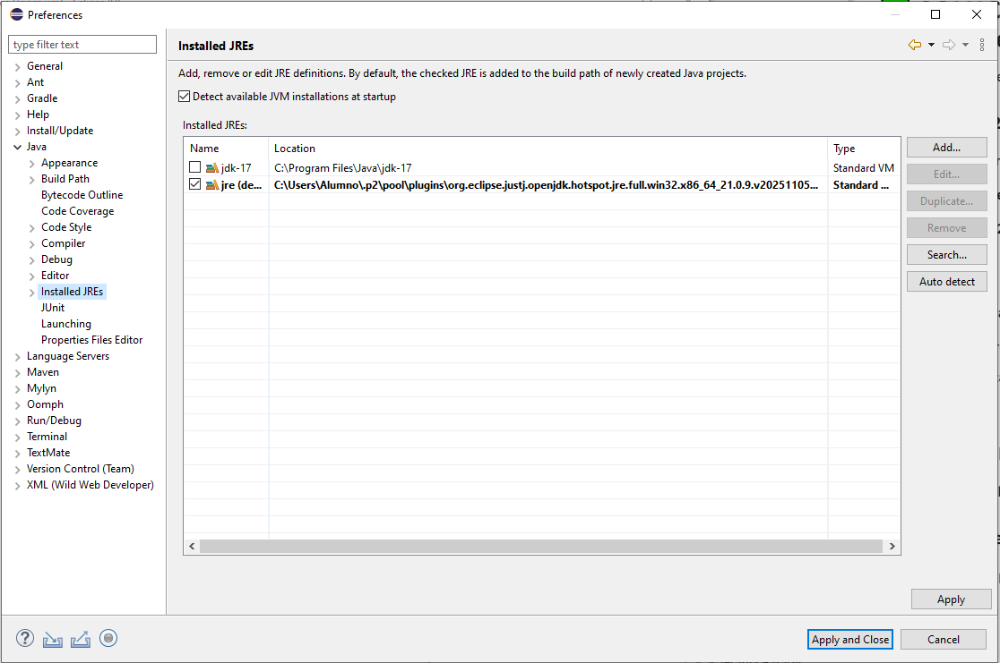
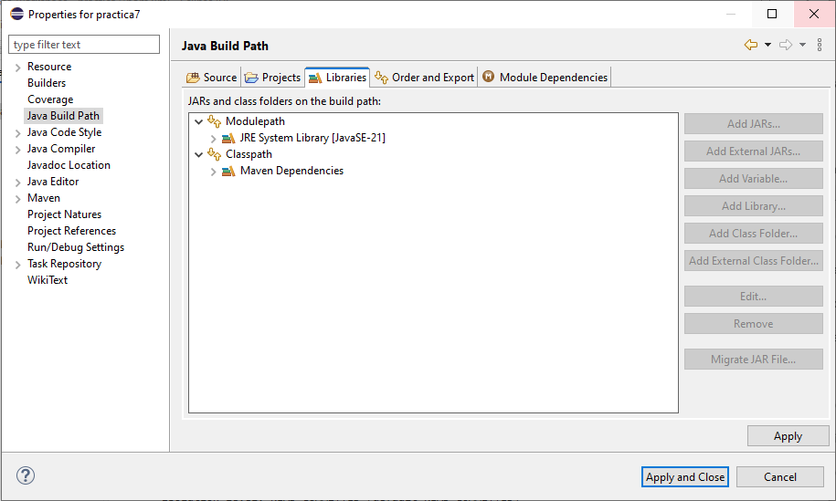

# GUÍA PARA CREACION DE UN PROYECTO EN ECLIPSE JUNTO SPRINGBOOT & SOLUCION DE ERRORES DE VERSIÓN
# Crear proyecto en eclipse con SpringBoot
## PASO 1 — Crear un proyecto Maven vacío en Eclipse
1. File → New → Maven Project
2. Marca Create a simple project (skip archetype selection)
3. Rellena:
  - Group Id: com.eva
  - Artifact Id: practica7
  - Version: por defecto
  - Packaging: jar
4. Finish.

## PASO 2 — Copiar tu proyecto Spring Boot dentro del Maven
En tu proyecto Spring Boot original tienes algo así:
```
src/main/java/com/example/practica7/Practica7Application.java
```
Haz lo siguiente:
1. Copia todo el paquete com.example.practica7
2. Pégalo dentro de:
```
src/main/java/com/eva/practica7/
```
Si Eclipse te pregunta si quieres actualizar el package, dile que sí.

Tu clase principal debe quedar así:
```java
package com.eva.practica7;

import org.springframework.boot.SpringApplication;
import org.springframework.boot.autoconfigure.SpringBootApplication;

@SpringBootApplication
public class Practica7Application {
    public static void main(String[] args) {
        SpringApplication.run(Practica7Application.class, args);
    }
}
```

## PASO 3 — Ajustar tu pom.xml para que sea un proyecto Spring Boot
Tu pom.xml debe tener esta estructura mínima:
```xml
<project xmlns="http://maven.apache.org/POM/4.0.0"
         xmlns:xsi="http://www.w3.org/2001/XMLSchema-instance"
         xsi:schemaLocation="http://maven.apache.org/POM/4.0.0 https://maven.apache.org/xsd/maven-4.0.0.xsd">

    <modelVersion>4.0.0</modelVersion>

    <parent>
        <groupId>org.springframework.boot</groupId>
        <artifactId>spring-boot-starter-parent</artifactId>
        <version>4.0.2</version>
    </parent>

    <groupId>com.eva</groupId>
    <artifactId>practica7</artifactId>
    <version>0.0.1-SNAPSHOT</version>

    <properties>
        <java.version>21</java.version>
    </properties>

    <dependencies>

        <!-- Spring Boot Web -->
        <dependency>
            <groupId>org.springframework.boot</groupId>
            <artifactId>spring-boot-starter-web</artifactId>
        </dependency>

        <!-- JPA -->
        <dependency>
            <groupId>org.springframework.boot</groupId>
            <artifactId>spring-boot-starter-data-jpa</artifactId>
        </dependency>

        <!-- PostgreSQL -->
        <dependency>
            <groupId>org.postgresql</groupId>
            <artifactId>postgresql</artifactId>
            <scope>runtime</scope>
        </dependency>

    </dependencies>

    <build>
        <plugins>
            <plugin>
                <groupId>org.springframework.boot</groupId>
                <artifactId>spring-boot-maven-plugin</artifactId>
            </plugin>
        </plugins>
    </build>

</project>
```

## PASO 4 — Configurar application.properties
En:
```
src/main/resources/application.properties
```
Pon:
```
spring.application.name=practica7
spring.datasource.url=jdbc:postgresql://localhost:5432/acceso_a_datos
spring.datasource.username=postgres
spring.datasource.password=postgres
spring.jpa.hibernate.ddl-auto=update
spring.jpa.show-sql=true
spring.jpa.properties.hibernate.dialect=org.hibernate.dialect.PostgreSQLDialect
```

## PASO 5 — Ejecutar con Maven en Eclipse
1. Clic derecho en el proyecto
2. Run As → Maven Build…
3. En Goals, escribe:
```
spring-boot:run
```
4. Run.

# Cambiar la version del proyecto

## Paso 1: Cambiar el JDK predeterminado en Eclipse
1. Ve a Window → Preferences → Java → Installed JREs
2. Marca la casilla de jdk-17 como predeterminado (no el jre (default))
3. Haz clic en Apply and Close

## Paso 2: Asegurar que tu proyecto usa JDK 17
1. Clic derecho en tu proyecto → Properties
2. Ve a Java Build Path → Libraries
  - Si ves JRE System Library [jre (default)], haz clic en Edit
  - Selecciona jdk-17
3. Ve a Java Compiler
  - Marca “Enable project specific settings”
  - En Compiler compliance level, selecciona 17
4. Apply and Close

## Paso 3: Ajustar tu pom.xml si es necesario
```xml
<properties>
    <java.version>17</java.version>
</properties>
```

# Cambiar el JRE del proyecto

1. Clic derecho en tu proyecto → Properties
2. Ve a Java Build Path → Libraries
3. Selecciona JRE System Library [JavaSE-21] → haz clic en Remove
4. Luego haz clic en Add Library…
  - Selecciona JRE System Library → Next
  - Elige Alternate JRE → selecciona jdk-17
  - Finish
5. Ve a Java Compiler (en el panel izquierdo)
  - Marca “Enable project specific settings”
  - En Compiler compliance level, selecciona 17
  - Apply and Close
