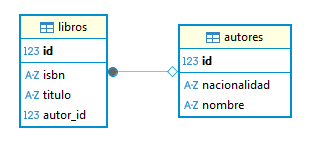

# Practica 7

> **Nota:**  
> - **Comprobar que hay en el puerto 8080** -> ``` netstat -ano | findstr :8080 ```  
> - **Cortar proceso** -> ``` taskkill /PID <PID> /F ```
---
## Ejercicio guiado.
En esta práctica vamos a trabajar con las siguientes tecnologías:


### Parte 1: PostgreSQL (base de datos)
Acceda a la siguiente página: https://www.postgresql.org/download/ y descargue PostgreSQL.
Una vez descargado podemos probar si funciona ejecutando el siguiente comando en una terminal (git bash):

| ``` psql postgres ``` |
|-----------------------|

A continuación vamos a crear un usuario y su contraseña para acceder a nuestra base de datos, utilizaremos el siguiente comando:

| ``` postgres=# CREATE USER postgres WITH PASSWORD 'postgres'; ``` |
|-----------------------|

Por último vamos a crear una base de datos con nombre acceso_a_datos utilizando el siguiente comando:

| ``` postgres=# CREATE DATABASE acceso_a_datos; ``` |
|-----------------------|


### Parte 2: DBeaver (gestor de base de datos)
Vamos a instalar el gestor de base de datos DBeaver, el cual es openSource y permite conectarnos a muchos tipos diferentes de bases de datos. Es un programa muy ligero y eficiente.
Para instalar DBeaver deberemos acceder a la siguiente página: https://dbeaver.io/.
A continuación podemos probar a conectar la base de datos previamente creada con DBeaver.

Para ello debemos dirigirnos a la opción de añadir una conexión con una base de datos. Dentro del menú que aparece debemos indicar que nos queremos conectar a una base de datos de tipo PostgreSQL:


Tras esto debemos rellenar información acerca nuestra base de datos que previamente hemos configurado, **sustituyendo los datos necesarios por los que esté utilizando en su proyecto**:


Tras realizar esta configuración podemos observar que aparece nuestra base de datos conectada en DBeaver. En este punto ya podríamos realizar consultas sobre nuestra base de datos.


### Parte 3: Spring Boot (Framework Java) + Hibernate
Como ya sabemos para inicializar un proyecto con Sprint Boot, nos dirigimos a la siguiente página: https://start.spring.io/ y aplicamos en este caso la siguiente configuración, **sustituyendo los datos necesarios por los que esté utilizando en su proyecto**:


Puede observar que estamos instalando una dependencia diferente respecto a la práctica anterior: un driver para nuestra base de datos PostgreSQL. Además ahora podemos observar que la dependencia Spring Data JPA incluye Hibernate.

### Parte 4: Java + Maven (lenguaje + gestor de dependencias)
Rellene en el archivo application.properties con los siguientes campos, sustituyendo los datos necesarios por los que esté utilizando en su proyecto:


Codigo ```application.properties``` 
---
```
spring.application.name=practica7
spring.datasource.url=jdbc:postgresql://localhost:5433/acceso_a_datos
spring.datasource.username=postgres
spring.datasource.password=admin

spring.jpa.hibernate.ddl-auto=update
spring.jpa.show=true
spring.jpa.properties.hibernate.dialect=org.hibernate.dialect.PostgreSQLDialect
```
Para lanzar una aplicación Spring Boot deberá añadir la siguiente configuración, recuerde que este paso cambiará si usa Ant o Gradle para su proyecto:


## Ejercicio

### Parte 1: Creación de las clases persistentes.
Piense en dos conceptos que estén relacionados y represente dichos conceptos como **clases persistentes**. Al ser dos conceptos relacionados un atributo de una clase hará referencia a otro atributo de la otra clase, **deberá investigar cómo implementar dicha relación**.

Ejemplo conceptual de relación: Una película tendrá de atributos id, nombre, duración, etc... Una sesión de cine tendrá los atributos id, hora, id_película donde id_película hace referencia al id de la película de la otra clase persistente.

 Codigo ```Autor.java``` 
---
```java
package com.example.practica7;

import jakarta.persistence.Entity;
import jakarta.persistence.GeneratedValue;
import jakarta.persistence.GenerationType;
import jakarta.persistence.Id;
import jakarta.persistence.Table;

@Entity
@Table(name = "autores")
public class Autor {

	@Id
    @GeneratedValue(strategy = GenerationType.IDENTITY)
    private Long id;

    private String nombre;
    private String nacionalidad;

    public Autor() {}

    public Autor(String nombre, String nacionalidad) {
        this.nombre = nombre;
        this.nacionalidad = nacionalidad;
    }

    public Long getId() { return id; }
    public void setId(Long id) { this.id = id; }
    public String getNombre() { return nombre; }
    public void setNombre(String nombre) { this.nombre = nombre; }
    public String getNacionalidad() { return nacionalidad; }
    public void setNacionalidad(String nacionalidad) { this.nacionalidad = nacionalidad; }

}
```

 Codigo ```Libro.java``` 
---
```java
package com.example.practica7;

import jakarta.persistence.Entity;
import jakarta.persistence.GeneratedValue;
import jakarta.persistence.GenerationType;
import jakarta.persistence.Id;
import jakarta.persistence.JoinColumn;
import jakarta.persistence.ManyToOne;
import jakarta.persistence.Table;

@Entity
@Table(name = "libros")
public class Libro {

	@Id
    @GeneratedValue(strategy = GenerationType.IDENTITY)
    private Long id;

    private String titulo;
    private String isbn;

    @ManyToOne
    @JoinColumn(name = "autor_id") // Esta es la clave ajena (FK)
    private Autor autor;

    public Libro() {}

    public Libro(String titulo, String isbn, Autor autor) {
        this.titulo = titulo;
        this.isbn = isbn;
        this.autor = autor;
    }

    public Long getId() { return id; }
    public String getTitulo() { return titulo; }
    public void setTitulo(String titulo) { this.titulo = titulo; }
    public String getIsbn() { return isbn; }
    public void setIsbn(String isbn) { this.isbn = isbn; }
    public Autor getAutor() { return autor; }
    public void setAutor(Autor autor) { this.autor = autor; }
}
```

Una vez creadas las **clases persistentes**, lance el programa a continuación para que se creen las dos clases persistentes anteriores y haciendo uso de DBeaver muestre que las dos tablas anteriores se han creado:



### Parte 2: Creación de las clases service.
Como hemos visto en clase, una vez que tenemos las clases persistentes necesitamos crearnos **clases “service”** que son clases que nos permiten trabajar con clases persistentes, manipularlas y realizar operaciones CRUD (insertar, leer, borrar, actualizar datos).

Deberá crear dos servicios, uno para cada clase persistente mostrada anteriormente donde se puedan realizar las siguientes operaciones (un método para cada una de las siguientes operaciones):

- Insertar (debe devolver el id del objeto insertado).
- Borrar dado un objeto (parámetro).
- Actualizar un objeto dado un id y un atributo.
(En mi ejemplo podría ser actualizar la hora de una sesión dado su id por parámetro así como la
nueva hora).
- Obtener un objeto dado un id (parámetro).
- Obtener uno o varios objetos dado un atributo diferente del id (parámetro).

(En mi ejemplo podríamos tener un método que obtenga las sesiones que empiecen a una determinada hora).

 Codigo ```AutorService.java``` 
---
```java
package com.example.practica7;

import org.hibernate.Session;
import org.hibernate.SessionFactory;
import org.hibernate.Transaction; 
import org.springframework.beans.factory.annotation.Autowired;
import org.springframework.stereotype.Service;
import java.util.List;

@Service
public class AutorService {

	
    @Autowired
    private SessionFactory sessionFactory;
    
    public AutorService() {}
    
    // Insertar (debe devolver el id del objeto insertado).
    public Long insertarAutor(Autor autor) {
    	Session session = sessionFactory.openSession();
    	Transaction transaction = null;
    	
    	try {
    		transaction = session.beginTransaction();
    		session.persist(autor);
    		transaction.commit();
    		return autor.getId();
    	} catch (Exception e) {
    		if(transaction != null) {
    			transaction.rollback();
    		}
    		e.printStackTrace();
    	} finally {
    		session.close();
    	}
		return (long) (-1);
    }
    
    // Borrar dado un objeto (parámetro).
    public void borrarAutor(Autor autor) {
        Session session = sessionFactory.openSession();
        Transaction transaction = null;
        
        try {
            transaction = session.beginTransaction();

			// Borra este autor.
			// Si ya está dentro de la sesión, bórralo directamente.
			// Si no lo está, primero mézclalo (merge) para obtener una versión gestionada y luego bórralo.
            session.remove(session.contains(autor) ? autor : session.merge(autor));
            
            transaction.commit();
        } catch (Exception e) {
            if (transaction != null) {
                transaction.rollback();
            }
            e.printStackTrace();
        } finally {
            session.close();
        }
    }
    
    // Actualizar un objeto dado un id y un atributo (nacionalidad).
    public void actualizarNacionalidad(Long id, String nuevaNacionalidad) {
        Session session = sessionFactory.openSession();
        Transaction transaction = null;
        
        try {
            transaction = session.beginTransaction();
            Autor autor = session.get(Autor.class, id);
            
            autor.setNacionalidad(nuevaNacionalidad);
            session.merge(autor);
            transaction.commit();
            
        } catch (Exception e) {
            if (transaction != null) {
                transaction.rollback();
            }
            e.printStackTrace();
        } finally {
            session.close();
        }
    }
    
    // Obtener un objeto dado un id (parámetro).
    public Autor obtenerAutorPorId(Long id) {
        Session session = sessionFactory.openSession();
        Autor autor = null;
        
        try {
            autor = session.get(Autor.class, id);
            
        } catch (Exception e) {
            e.printStackTrace();
        } finally {
            session.close();
        }
        
        return autor;
    }
    
    public List<Autor> obtenerAutoresPorNombre(String nombreParametro) {
        Session session = sessionFactory.openSession();
        List<Autor> listaAutores = null;
        
        try {
            listaAutores = session.createQuery("FROM Autor WHERE nombre = :n", Autor.class)
                                  .setParameter("n", nombreParametro)
                                  .list();
            
        } catch (Exception e) {
            e.printStackTrace();
        } finally {
            session.close();
        }
        
        return listaAutores;
    }
    

}
```

 Codigo ```LibroService.java``` 
---
```java
package com.example.practica7;

import org.hibernate.Session;
import org.hibernate.SessionFactory;
import org.hibernate.Transaction; 
import org.springframework.beans.factory.annotation.Autowired;
import org.springframework.stereotype.Service;
import java.util.List;

@Service
public class LibroService {

    @Autowired
    private SessionFactory sessionFactory;
    
    public LibroService() {}
    
    // Insertar (debe devolver el id del objeto insertado).
    public Long insertarLibro(Libro libro) {
        Session session = sessionFactory.openSession();
        Transaction transaction = null;
        
        try {
            transaction = session.beginTransaction();
            session.persist(libro); 
            transaction.commit();
            return libro.getId();
        } catch (Exception e) {
            if(transaction != null) {
                transaction.rollback();
            }
            e.printStackTrace();
        } finally {
            session.close();
        }
        return (long) (-1);
    }
    
    // Borrar dado un objeto (parámetro).
    public void borrarLibro(Libro libro) {
        Session session = sessionFactory.openSession();
        Transaction transaction = null;
        
        try {
            transaction = session.beginTransaction();
            session.remove(session.contains(libro) ? libro : session.merge(libro));
            transaction.commit();
        } catch (Exception e) {
            if (transaction != null) {
                transaction.rollback();
            }
            e.printStackTrace();
        } finally {
            session.close();
        }
    }
    
    // Obtener un objeto dado un id (parámetro).
    public Libro obtenerLibroPorId(Long id) {
        Session session = sessionFactory.openSession();
        Libro libro = null;
        
        try {
            libro = session.get(Libro.class, id);
        } catch (Exception e) {
            e.printStackTrace();
        } finally {
            session.close();
        }
        return libro;
    }
    
    // Actualizar un atributo (título) dado un id.
    public void actualizarTitulo(Long id, String nuevoTitulo) {
        Session session = sessionFactory.openSession();
        Transaction transaction = null;
        
        try {
            transaction = session.beginTransaction();
            Libro libro = session.get(Libro.class, id);
            
            libro.setTitulo(nuevoTitulo);
            session.merge(libro); 

			transaction.commit();
        } catch (Exception e) {
            if (transaction != null) {
                transaction.rollback();
            }
            e.printStackTrace();
        } finally {
            session.close();
        }
    }
    
    // Obtener por otro atributo (ISBN) usando HQL.
    public List<Libro> obtenerLibrosPorIsbn(String isbnParam) {
        Session session = sessionFactory.openSession();
        List<Libro> listaLibros = null;
        
        try {
            
            listaLibros = session.createQuery("FROM Libro WHERE isbn = :i", Libro.class)
                                  .setParameter("i", isbnParam)
                                  .list();
            
        } catch (Exception e) {
            e.printStackTrace();
        } finally {
            session.close();
        }
        return listaLibros;
    }
}
```

### Parte 3: Utilización de todo lo creado hasta ahora.
A continuación vamos a probar todas las operaciones que hemos programado mediante objetos persistentes y servicios y verificaremos en base de datos dichas operaciones.

#### Parte 3.1. Operaciones de la clase no relacionada
Deberá realizar en el método main( ) las siguientes operaciones sobre la clase no relacionada (la
captura mostrada a continuación trabaja sobre mi ejemplo para que sea más claro. Debéis
aplicarlo sobre vuestro caso y poner comentarios similares):


#### Parte 3.2. Operaciones de la clase relacionada
Deberá realizar en el método main( ) las siguientes operaciones sobre la clase relacionada (la
captura mostrada a continuación trabaja sobre mi ejemplo para que sea más claro. Debéis
aplicarlo sobre vuestro caso y poner comentarios similares):


 Codigo ```Practica7Application.java``` 
---
```java
package com.example.practica7;

import org.springframework.beans.factory.annotation.Autowired;
import org.springframework.boot.CommandLineRunner;
import org.springframework.boot.SpringApplication;
import org.springframework.boot.autoconfigure.SpringBootApplication;
import java.util.List;

@SpringBootApplication
public class Practica7Application implements CommandLineRunner {

    @Autowired
    private AutorService autorService;

    @Autowired
    private LibroService libroService;

    public static void main(String[] args) {
        SpringApplication.run(Practica7Application.class, args);
    }

    @Override
    public void run(String... args) throws Exception {
        
        System.out.println("\n--- INICIO DE LAS PRUEBAS ---\n");
        // --- AUTORES ---
        Long idAutor1 = insertarAutor(autorService, "Miguel de Cervantes", "Española");
        Long idAutor2 = insertarAutor(autorService, "Gabriel García Márquez", "Colombiana");
        borrarAutor(autorService, idAutor1); 
        obtenerAutorPorId(autorService, idAutor2); 
        actualizarNacionalidad(autorService, idAutor2); 
        buscarPorNombre(autorService); 
        
        // --- LIBROS ---
        Long idLibro1 = insertarLibro(libroService, idAutor2, "Cien años de soledad", "978-1234");
        Long idLibro2 = insertarLibro(libroService, idAutor2, "El amor en los tiempos del cólera", "978-5678");
        borrarLibro(libroService, idLibro1); 
        obtenerLibroPorId(libroService, idLibro2); 
        actualizarTitulo(libroService, idLibro2); 
        buscarLibroPorIsbn(libroService); 
        System.out.println("\n--- FIN DE LAS PRUEBAS ---");

    }
    
    private Long insertarAutor(AutorService autorService, String nombre, String nacionalidad) {

        Autor autor = new Autor(nombre, nacionalidad);
        Long id = autorService.insertarAutor(autor);

        System.out.println(
                "[1] Autor insertado -> " + autor.getNombre() + 
                " (" + autor.getNacionalidad() + 
                "), ID: " + id);

        return id;
    }

    private void borrarAutor(AutorService autorService, Long idAutor) {
        Autor autor = autorService.obtenerAutorPorId(idAutor);
        autorService.borrarAutor(autor);

        System.out.println(
                "[2] Autor borrado -> " + autor.getNombre() + 
                " (" + autor.getNacionalidad() + 
                "), ID: " + autor.getId());
    }

    private void obtenerAutorPorId(AutorService autorService, Long idAutor) {
        Autor autor = autorService.obtenerAutorPorId(idAutor);

        System.out.println(
                "[3] Autor obtenido por ID -> " + autor.getNombre() + 
                " (" + autor.getNacionalidad() + 
                "), ID: " + autor.getId());
    }
    
    private void actualizarNacionalidad(AutorService autorService, Long idAutor) {
        Autor autor = autorService.obtenerAutorPorId(idAutor);
        String anterior = autor.getNacionalidad();

        autorService.actualizarNacionalidad(idAutor, "Latinoamericana");

        System.out.println(
                "[4] Nacionalidad actualizada -> " + autor.getNombre() + 
                ": " + anterior + " -> Latinoamericana");
    }
    
    private void buscarPorNombre(AutorService autorService) {
        List<Autor> autores = autorService.obtenerAutoresPorNombre("Gabriel García Márquez");

        System.out.println("[5] Búsqueda por nombre -> " + autores.size() + " autor(es) encontrado(s)");
        for (int i = 0; i < autores.size(); i++) {
            Autor a = autores.get(i);
            System.out.println(
                    "     - " + a.getNombre() + 
                    " (" + a.getNacionalidad() + ")");
        }

    }
    
    private Long insertarLibro(LibroService libroService, Long idAutor, String titulo, String isbn) {

        Autor autor = new Autor();
        autor.setId(idAutor);

        Libro libro = new Libro(titulo, isbn, autor);
        Long id = libroService.insertarLibro(libro);

        System.out.println(
                "[6] Libro insertado -> " + libro.getTitulo() + 
                " (ISBN: " + libro.getIsbn() + 
                "), ID: " + id);

        return id;
    }

    
    private void borrarLibro(LibroService libroService, Long idLibro) {
        Libro libro = libroService.obtenerLibroPorId(idLibro);
        libroService.borrarLibro(libro);

        System.out.println(
                "[7] Libro borrado -> " + libro.getTitulo() + 
                " (ISBN: " + libro.getIsbn() + 
                "), ID: " + libro.getId());
    }

    private void obtenerLibroPorId(LibroService libroService, Long idLibro) {
        Libro libro = libroService.obtenerLibroPorId(idLibro);

        System.out.println(
                "[8] Libro obtenido por ID -> " + libro.getTitulo() + 
                " (ISBN: " + libro.getIsbn() + ")");
    }

    private void actualizarTitulo(LibroService libroService, Long idLibro) {
        Libro libro = libroService.obtenerLibroPorId(idLibro);
        String anterior = libro.getTitulo();

        libroService.actualizarTitulo(idLibro, anterior + " (Edición Especial)");

        System.out.println(
                "[9] Título actualizado -> " + anterior + 
                " -> " + libro.getTitulo());
    }

    private void buscarLibroPorIsbn(LibroService libroService) {
        List<Libro> libros = libroService.obtenerLibrosPorIsbn("978-5678");

        System.out.println("[10] Búsqueda por ISBN -> " + libros.size() + " libro(s) encontrado(s)");
        for (int i = 0; i < libros.size(); i++) {
            Libro l = libros.get(i);
            System.out.println(
                    "     - " + l.getTitulo() + 
                    " (ISBN: " + l.getIsbn() + ")");
        }

    }

}
```

