# Practica 8.2

> **Nota:**  
> - **Comprobar que hay en el puerto 8080** -> ``` netstat -ano | findstr :8080 ```  
> - **Cortar proceso** -> ``` taskkill /PID <PID> /F ```
---
## Ejercicio guiado.
En la práctica de los temas 7 y 8 creamos dos clases persistentes con sus servicios
correspondientes. Para realizar esta práctica deberá crear un controlador relacionado con la
clase persistente que contiene la clave externa con el objetivo de construir una API.

### 1. Método POST
Deberá crear un método para insertar elementos.
- La ruta deberá ser: /recurso dónde “recurso" en mi ejemplo sería sesiones.
- En el body de la petición no se incluirá la clave externa.
- En un parámetro se mandará el id de la clave externa.
- Si no se encuentra el elemento relacionado (película en mi caso) deberá devolver un mensaje de error descriptivo así como el código HTTP 404.
- Si todo va bien, devuelve el ID y el código 201.

```java
    @PostMapping
    public ResponseEntity<?> insertarLibro(
            @RequestBody Libro libro,  
            @RequestParam Long idAutor
    ) {
        Autor autor = autorService.obtenerAutorPorId(idAutor);

        if (autor == null) {
            return new ResponseEntity<>(
                "Error: No se puede crear el libro porque el autor con ID " + idAutor + " no existe.", 
                HttpStatus.NOT_FOUND
            );
        }

        libro.setAutor(autor);
        Long idGenerado = libroService.insertarLibro(libro);

        return new ResponseEntity<>(idGenerado, HttpStatus.CREATED);
    }
```

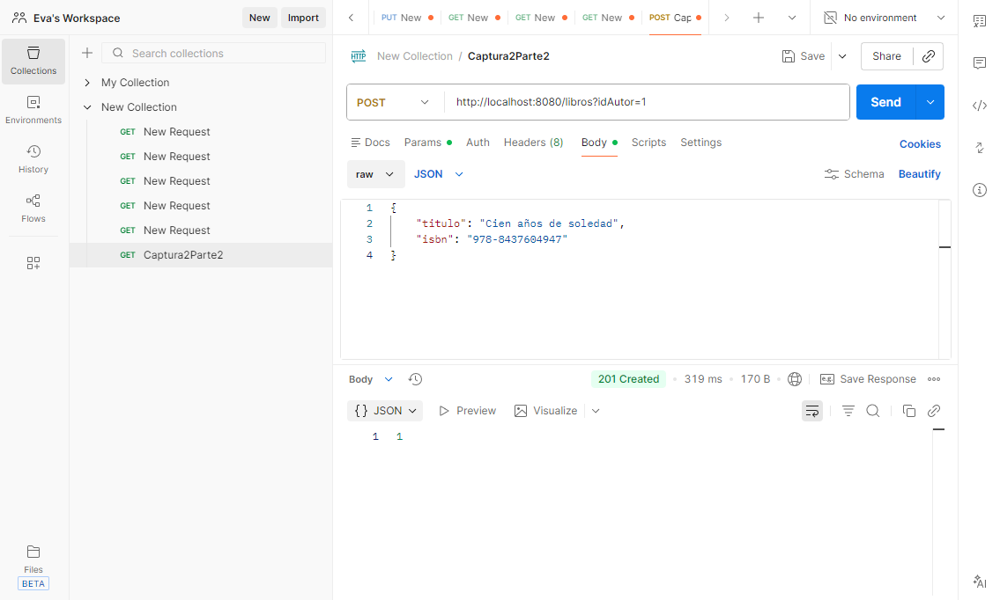
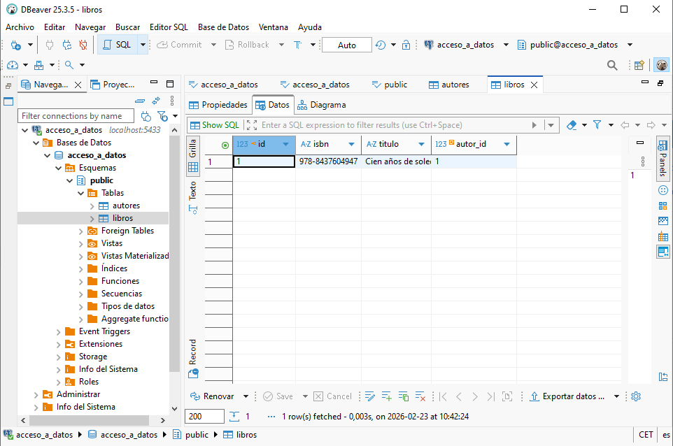
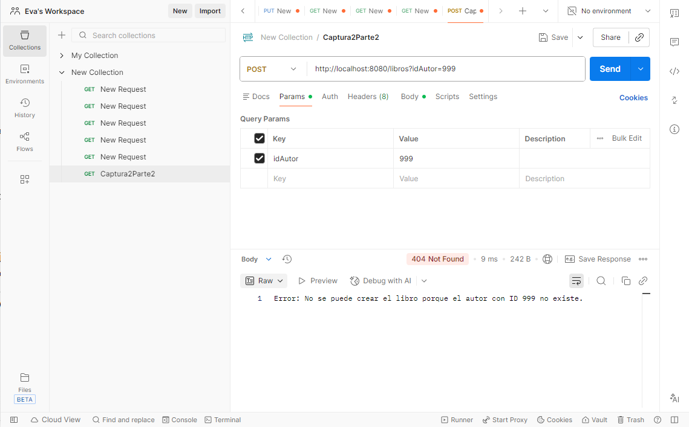

### 2. Método PUT atributo
Deberá crear un método para actualizar un atributo de un objeto. En mi caso podría crear
un método para actualizar la hora de una sesión y:
- La ruta sería ser: /sesiones/{id}/hora.
- En un parámetro se mandará el nuevo valor de atributo .
- Si no se encuentra el elemento asociado al id se devolverá un mensaje de error
descriptivo y el código HTTP 404.
- Si todo va bien devuelve el código 200.

```java
    @PutMapping("/{id}/titulo")
    public ResponseEntity<?> actualizarTitulo(
            @PathVariable Long id, 
            @RequestParam String nuevoTitulo) { 
    	
        Libro libro = libroService.obtenerLibroPorId(id);
        
        if (libro == null) {
            return new ResponseEntity<>("Error: No se encontró el libro con ID " + id + " para actualizar su título.", HttpStatus.NOT_FOUND);
        }

        libroService.actualizarTitulo(id, nuevoTitulo);
        return new ResponseEntity<>(HttpStatus.OK);
    }
```    

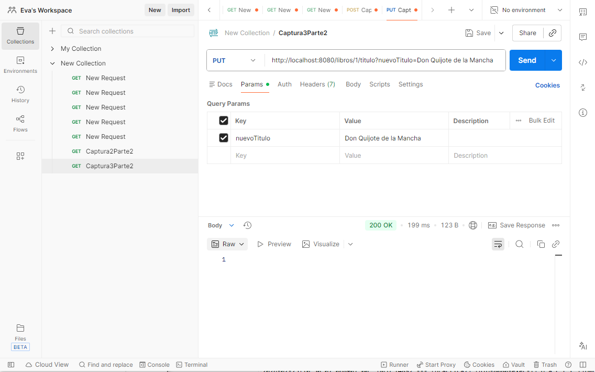
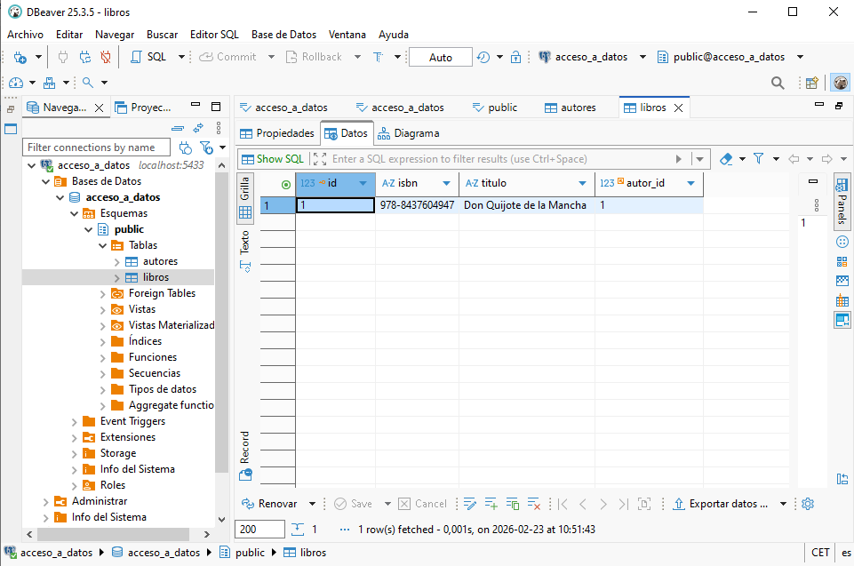
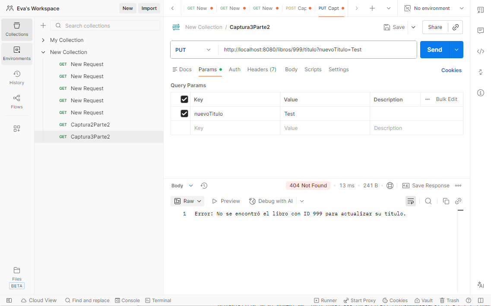

### 3. Método PUT clave externa
Deberá crear un método para actualizar la clave externa. En mi caso:
- La ruta sería ser: /sesiones/{id}/pelicula/{idPelicula}.
- Si no se encuentra el elemento asociado al id principal se devolverá un mensaje de
error descriptivo y el código HTTP 404.
- Si no se encuentra el elemento asociado al id de la clave externa se devolverá un
mensaje de error descriptivo y el código HTTP 404.
- Si todo va bien devuelve el código 200.

```java
    @PutMapping("/{id}/autor/{idAutor}")
    public ResponseEntity<?> actualizarAutor(@PathVariable Long id, @PathVariable Long idAutor) {
        Libro libro = libroService.obtenerLibroPorId(id);
        if (libro == null) {
            return new ResponseEntity<>("Error: No se encontró el libro con ID " + id, HttpStatus.NOT_FOUND);
        }

        Autor nuevoAutor = autorService.obtenerAutorPorId(idAutor);
        if (nuevoAutor == null) {
            return new ResponseEntity<>("Error: No se encontró el autor con ID " + idAutor, HttpStatus.NOT_FOUND);
        }

        libro.setAutor(nuevoAutor);
        
        // CAMBIO AQUÍ: Usamos el nuevo método de actualización
        libroService.actualizarLibro(libro); 
        
        return new ResponseEntity<>(HttpStatus.OK);
    }
```

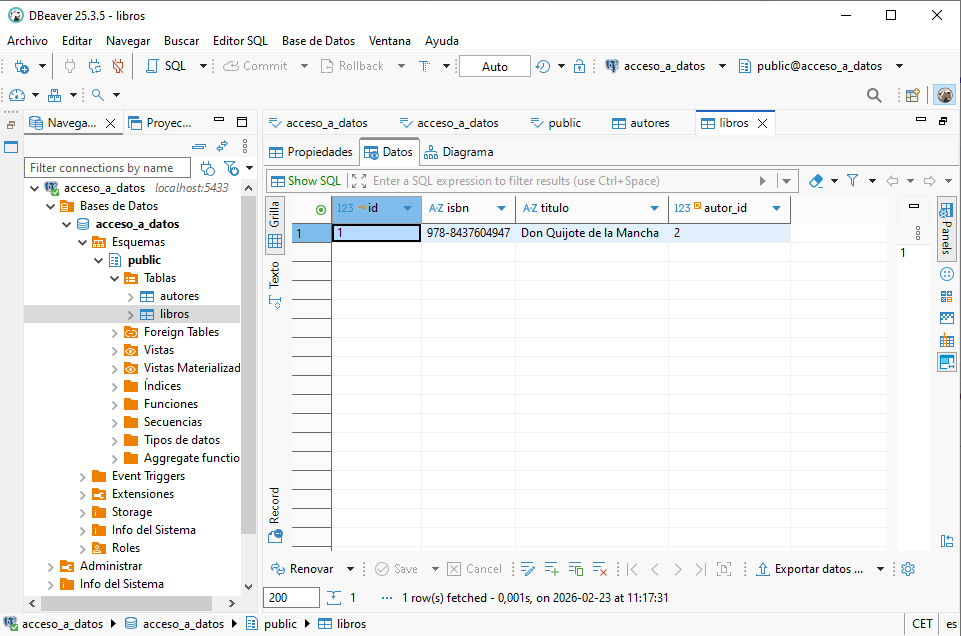
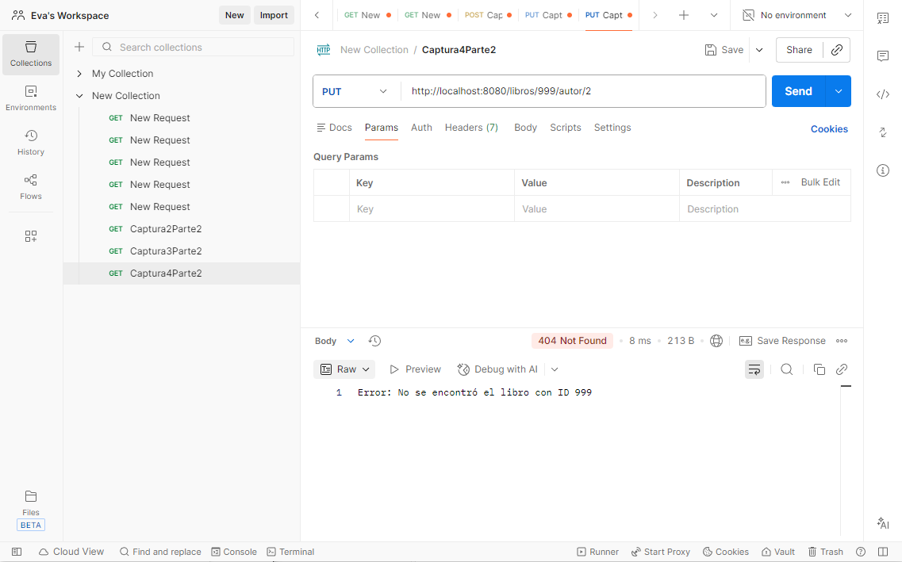
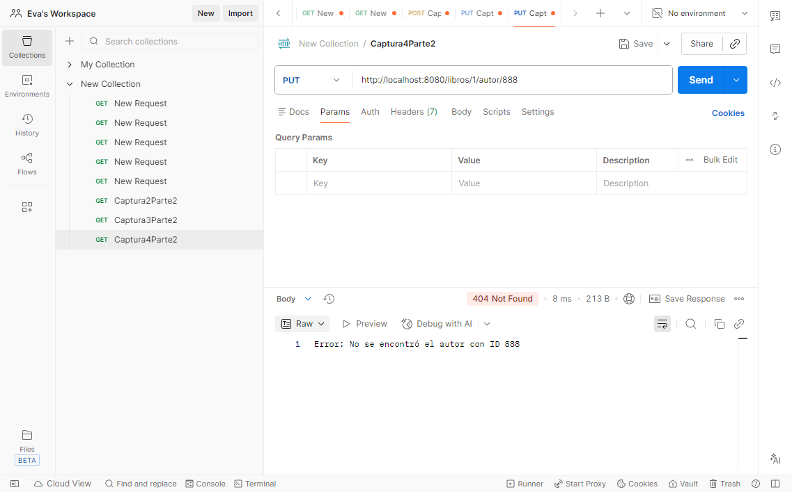

### 4. Método DELETE
Deberá crear un método para eliminar un elemento. En mi caso:
- La ruta sería ser: /sesiones/{id}.
- Si no se borra deberá devolver un código HTTP 404 y un texto descriptivo.
- Si se borra devuelve el código 200.

```java
	@DeleteMapping("/{id}")
	public ResponseEntity<?> eliminarLibro(@PathVariable Long id) {
	    Libro libro = libroService.obtenerLibroPorId(id);
	     
	    if (libro == null) {
	        return new ResponseEntity<>(
	            "Error: No se puede eliminar. El libro con ID " + id + " no existe en la base de datos.", 
	            HttpStatus.NOT_FOUND
	        );
	    }
	
	    try {
	        libroService.borrarLibro(libro);
	        return new ResponseEntity<>("Libro eliminado correctamente.", HttpStatus.OK);
	    } catch (Exception e) {
	        return new ResponseEntity<>(
	            "Error descriptivo: No se ha podido completar la eliminación.", 
	            HttpStatus.NOT_FOUND
	        );
	    }
	}
```

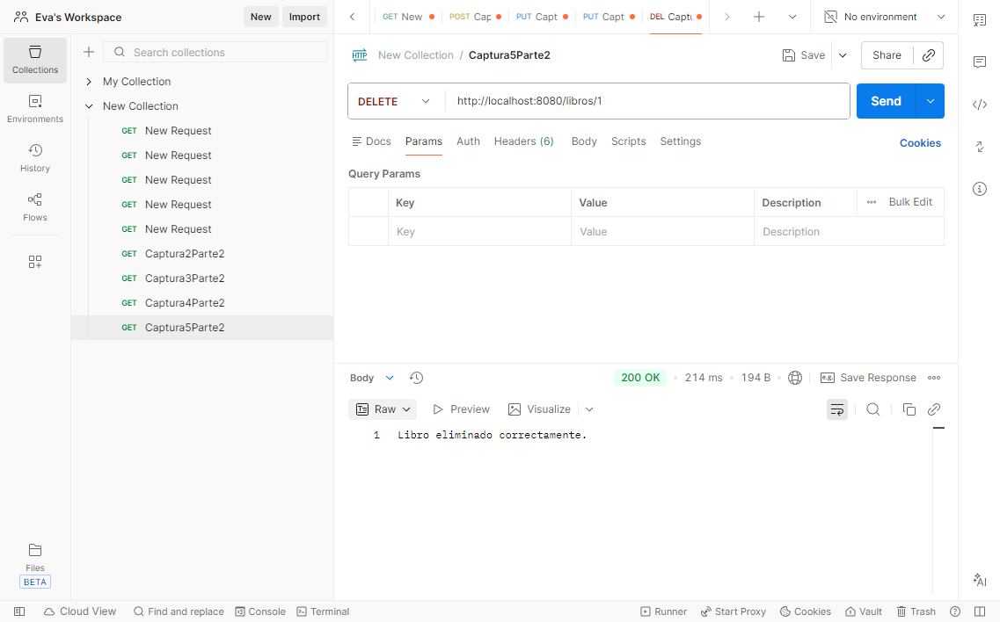
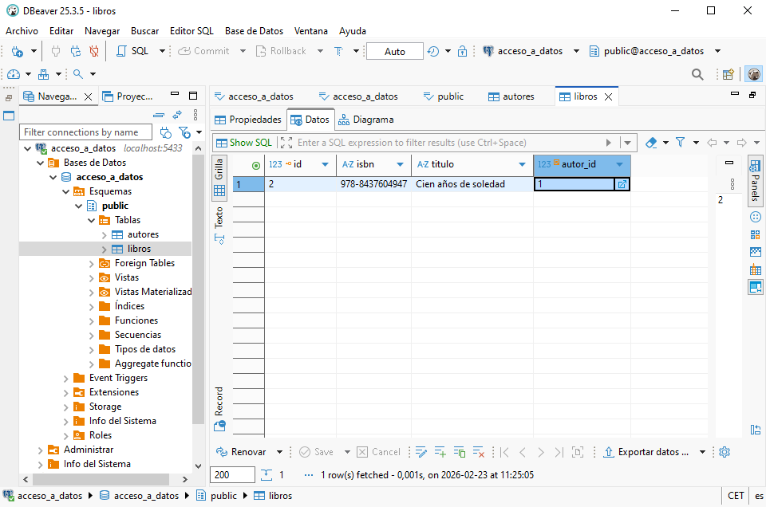
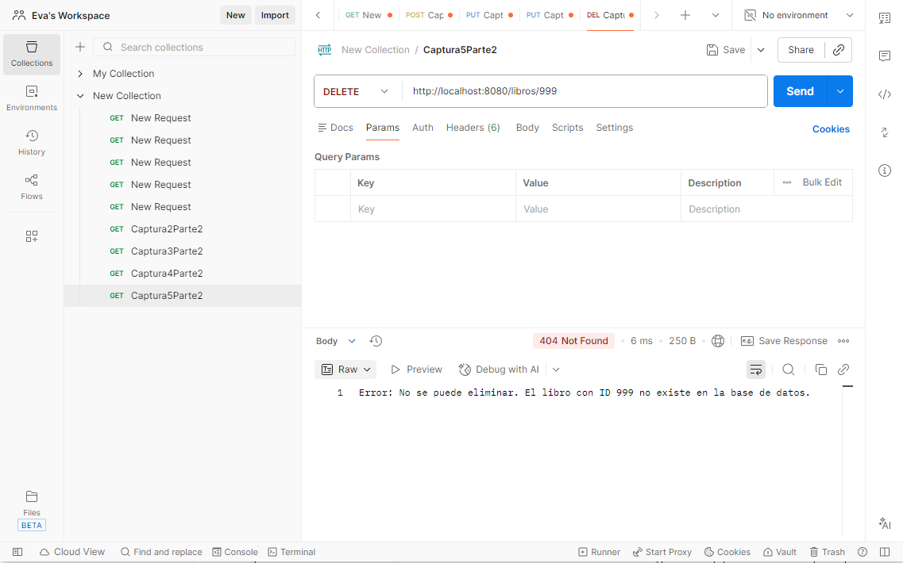

### 5. Método GET por id
Deberá crear un método para obtener un elemento dado un id.
- Si encuentra el elemento deberá devolver dicho elemento y el estado 200.
- Si no lo encuentra debe devolver un texto descriptivo y el código 404.

```java
	@GetMapping("/{id}")
	public ResponseEntity<?> obtenerLibroPorId(@PathVariable Long id) {
	    Libro libro = libroService.obtenerLibroPorId(id);

	    if (libro != null) {
	        return new ResponseEntity<>(libro, HttpStatus.OK);
	    } else {
	        return new ResponseEntity<>(
	            "Error: El libro con ID " + id + " no existe en nuestros registros.", 
	            HttpStatus.NOT_FOUND
	        );
	    }
	}
```

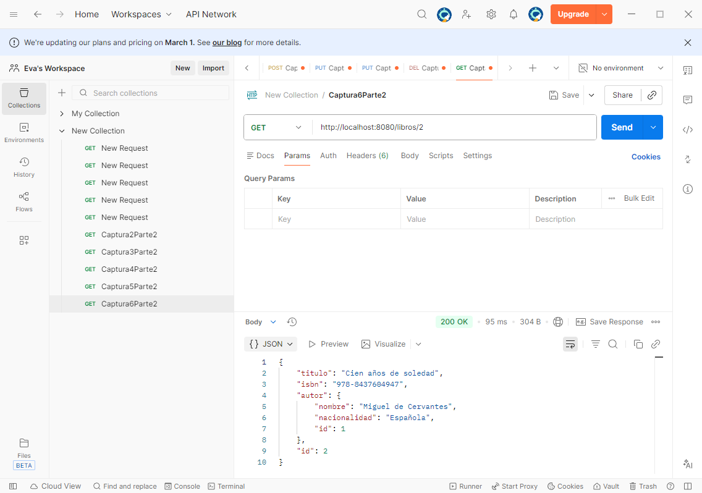
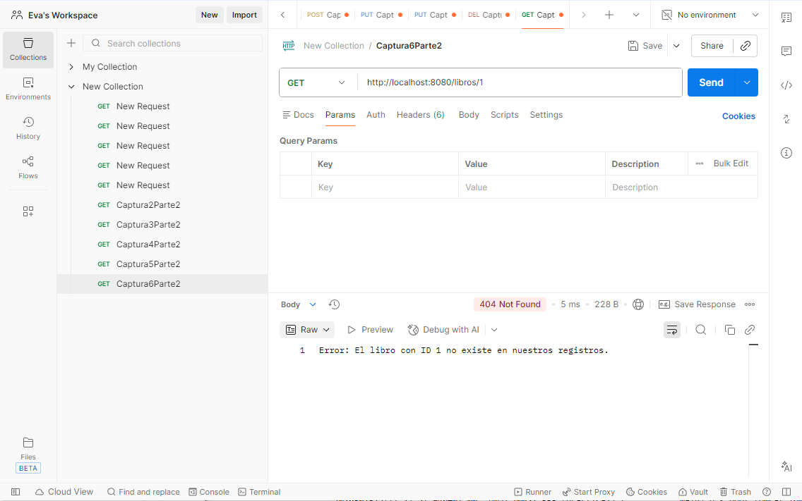

### 6. Método GET genérico
Deberá crear un método para obtener un elemento dado un id.
- Si encuentra elementos deberá devolver dichos elementos y el estado 200.
- Si no lo encuentra debe devolver un texto descriptivo y el código 404.

```java
	@GetMapping
	public ResponseEntity<?> obtenerTodos() {
	    List<Libro> libros = libroService.obtenerTodos();

	    if (libros != null && !libros.isEmpty()) {
	        return new ResponseEntity<>(libros, HttpStatus.OK);
	    } else {
	        return new ResponseEntity<>(
	            "No se encontraron libros en la base de datos.", 
	            HttpStatus.NOT_FOUND
	        );
	    }
	}
```

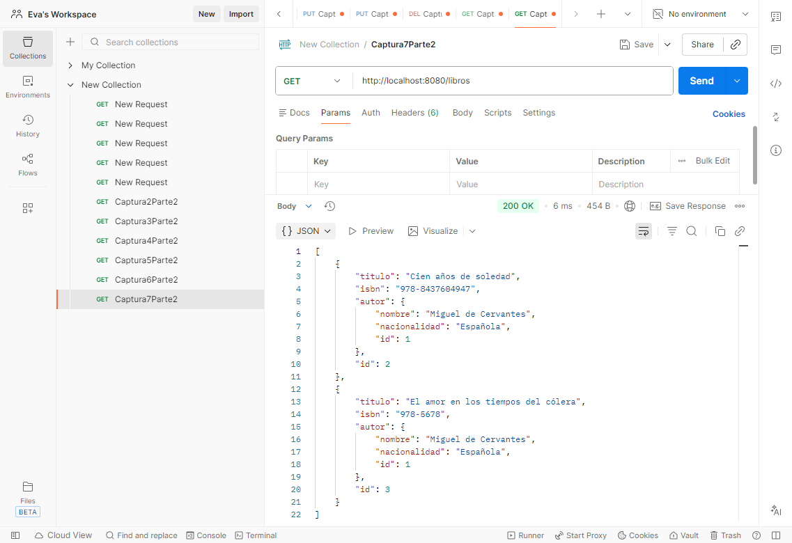
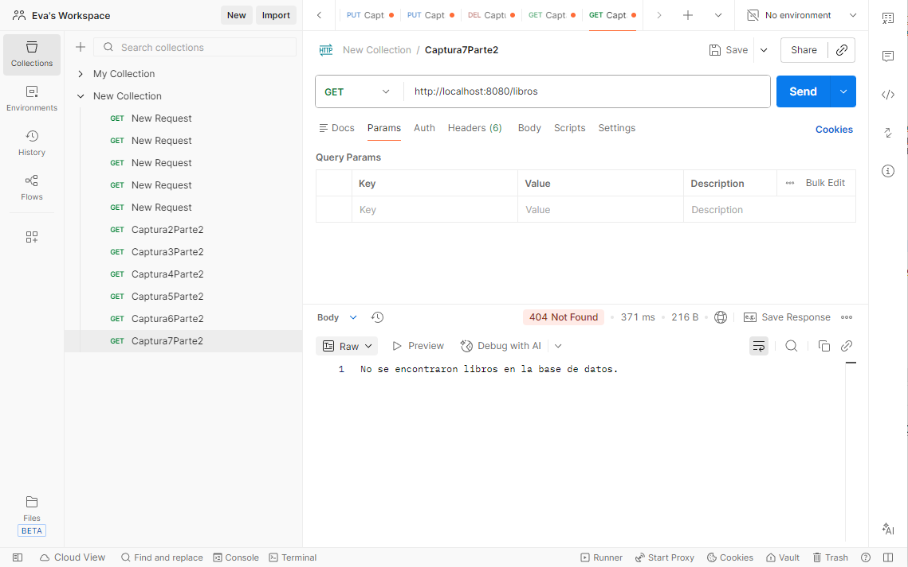