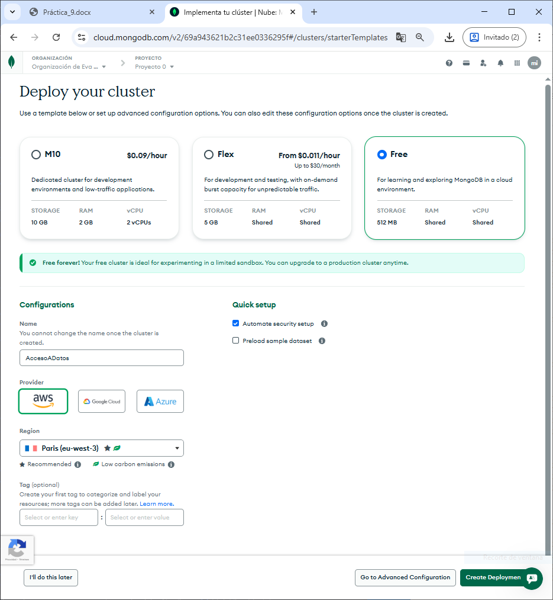
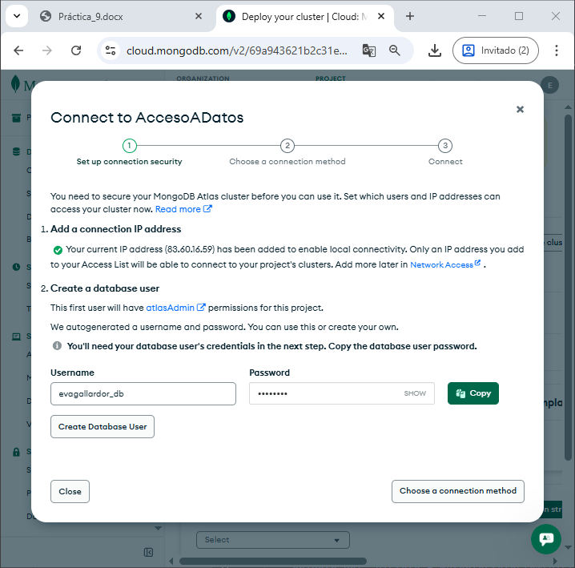
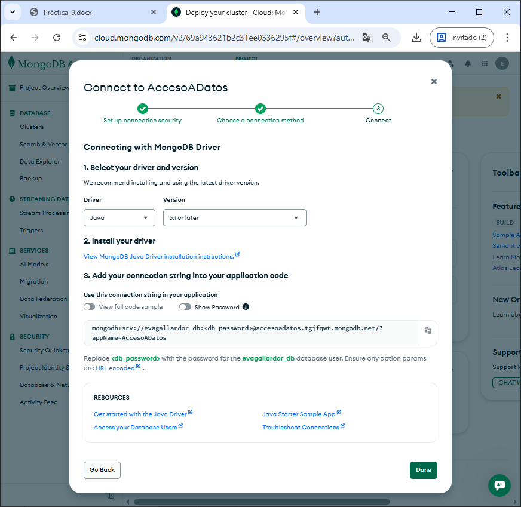
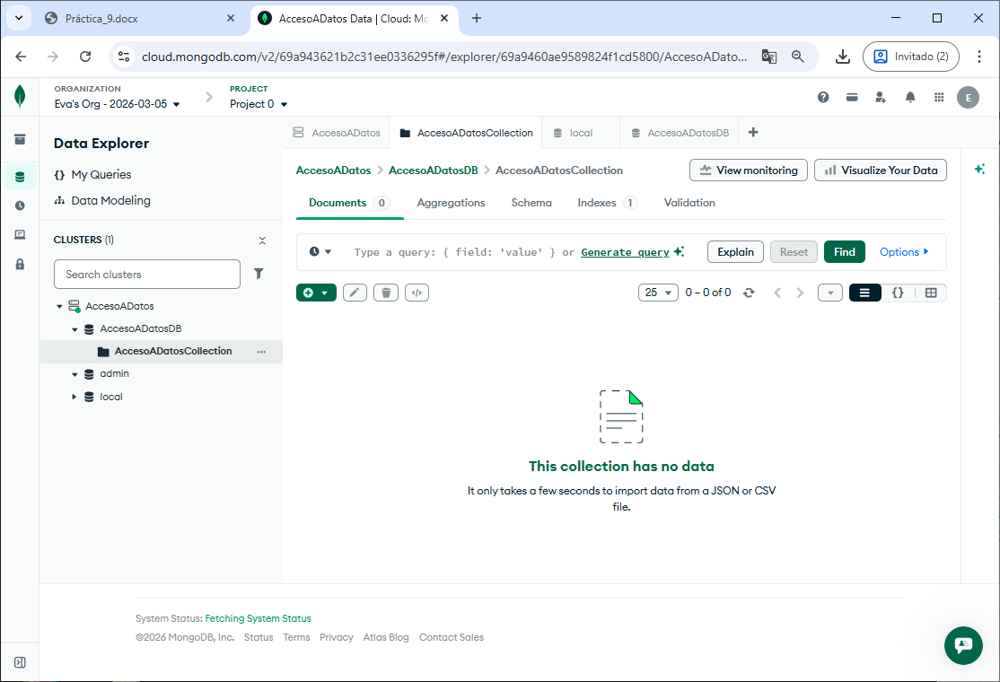
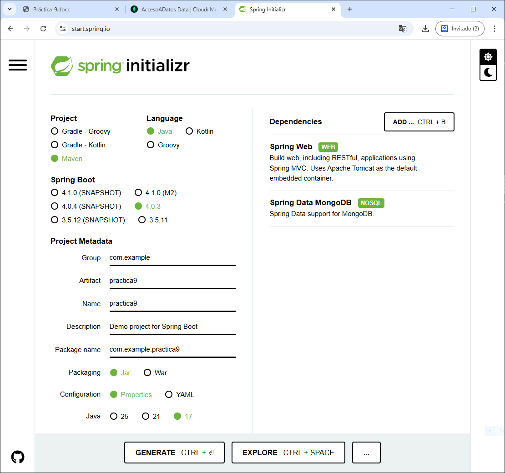
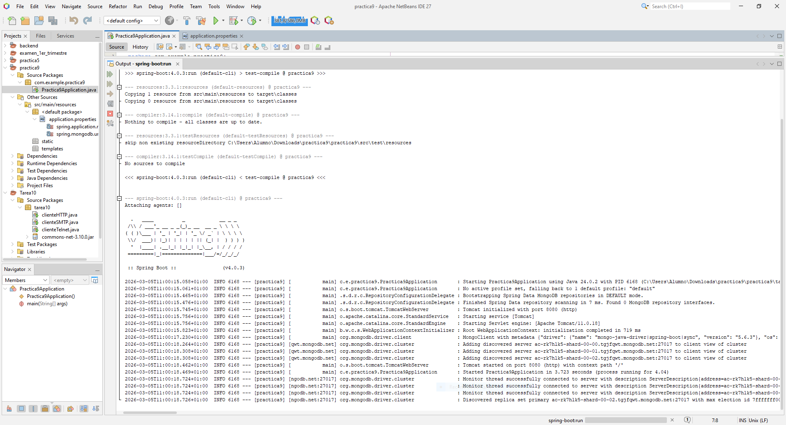
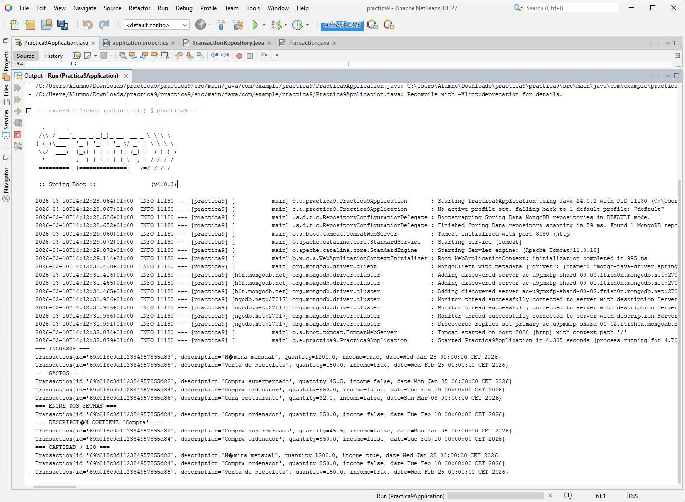
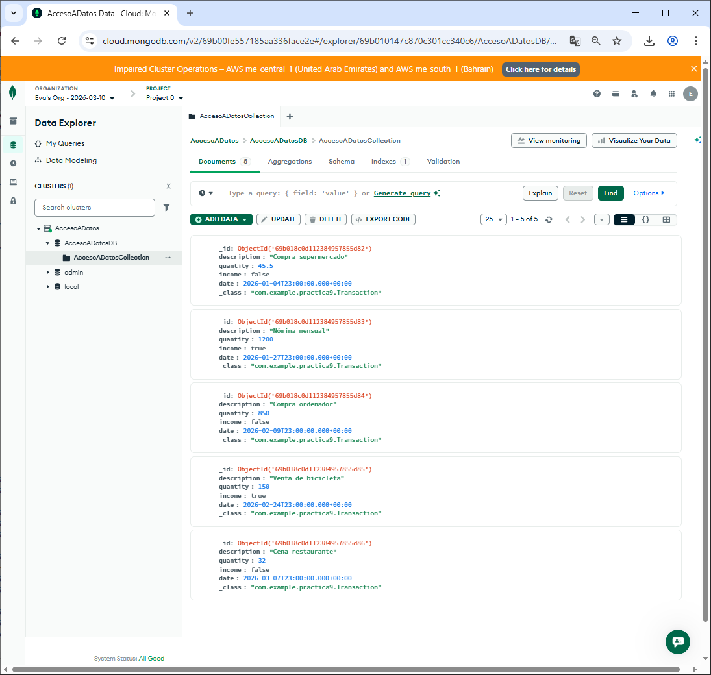

# Practica 9

## Ejercicio 
En esta práctica vamos a aprender a utilizar una base de datos en línea (nube) no relacional y veremos como establecer la conexión con nuestra aplicación desarrollada en Java haciendo uso de SpringBoot. Concretamente utilizaremos una base de datos MongoDB haciendo uso de sus SaaS (Software as a service) MongoDB Atlas.

### Parte 1: Registro en MongoDB Atlas
En primer lugar, como vamos a utilizar una base de datos en línea haciendo uso de MongoDB Atlas, nos dirigimos al siguiente enlace y nos registramos:
https://www.mongodb.com/cloud/atlas/register. Deberemos rellenar algunos datos, el más importante es el lenguaje que vamos a utilizar (Java) y con qué propósito se va a utilizar (microservicios (APIs)).


### Parte 2: Creación de un clúster
Para empezar a trabajar con MongoDB Atlas necesitamos crear un clúster.
Un clúster es un conjunto de servidores que trabajan conjuntamente como uno para proporcionar redundancia, escalabilidad y alta disponibilidad en la nube.
Para ello en el proceso de registro, en el segundo paso tenemos una pantalla que dice “Deploy your cluster”. Elegimos “M0” que es un clúster gratuito que ofrece MongoDB Atlas para aprender y explorar bases de datos en la nube de este tipo.
En el nombre del clúster escribimos AccesoADatos y a continuación podemos elegir entre varios proveedores, dejamos AWS y en región podémoste dejar la que encontramos por defecto.



Tras esto debemos pulsar en el botón “Create Deployment” que nos creará nuestro clúster para poder alojar una base de datos de tipo MongoDB en la nube.

### Parte 3: Guardar los datos de usuario administrador
A continuación aparecerá una pestaña emergente donde nos indica que se ha creado un usuario y una contraseña con permisos de administrador en las futuras bases de datos que vayamos a crear en nuestro clúster.
Incluya una captura de pantalla del usuario y la contraseña para evitar perder estos datos en un futuro.



Tras esto hacemos click en crear usuario y pasamos al siguiente paso haciendo click en “Choose a connection method”.

### Parte 4. Obtención de datos de conexión a MongoDB Atlas.
En este paso, como nos vamos a conectar a una base de datos en la nube, necesitamos obtener una serie de datos para establecer esta conexión desde nuestra aplicación Java.
Elegimos la opción “Drivers” ya que como hasta ahora, nos vamos a conectar a la base de datos haciendo uso de un conector Java.
Tras esto debemos dejar por defecto los datos del driver de Java y debemos copiar y guardarnos el string de conexión. IMPORTANTE NO PERDERLO. Esta cadena de texto nos permitirá establecer la conexión con nuestro clúster y base de datos.



### Parte 5. Creación de una BD y colección en MongoDB Atlas.
Nos dirigimos a la opción “Browse collections” de nuestro clúster, en esta sección podemos administrar las bases de datos. Eliminamos la base de datos que incluye por defecto y creamos una con el nombre AccesoADatosDB, para ello deberá hacer click en “Add my own data”. En el nombre de colección ponemos AccesoADatosCollection, una colección es el equivalente a una tabla, por ahora creamos una por defecto para poder continuar pero más adelante crearemos otras más realistas para la realización de la práctica.



### Parte 6. Creación de un proyecto en SpringBoot
Como siempre, nos dirigimos a https://start.spring.io/ y cambiamos los metadatos del proyecto a practica12_13_14 menos el package name que lo dejamos con lo que se genere. En la sección de dependencias añadimos “Spring Web” y “Spring Data MongoDB”. Y en tipo de proyecto elegimos “Maven”.



Tras esto, genere el proyecto e inclúyalo en Eclipse.

### Parte 7. Conectar la aplicación con MongoDB Atlas
En el archivo “application.properties” añadimos una nueva propiedad “spring.mongodb.uri=“ y pegamos sin espacios la cadena de conexión que obtuvimos en el paso 4.
Pruebe a iniciar la aplicación. Si falla revise que la cadena de conexión esté actualizada siguiendo este formato:

```mongodb+srv://<usuario>:<contraseña>@<cluster>.mongodb.net/<nombreBaseDatos>?retryWrites=true&w=majority```

Un fallo común es no incluir “nombreBaseDatos” ya que la generación automática de la cadena de conexión no suele incluirlo.



### Parte 8. Creación de un modelo de datos
Aunque los datos de las bases de datos no relacionales (llamados documentos) son flexibles y no necesariamente deben adaptarse a un modelo de datos concreto, crearemos un modelo de datos para facilitar el uso de dichos datos de forma
estandarizada en nuestra aplicación.
Para esta práctica vamos a crear el backend de una aplicación que nos permita llevar el control de nuestros gastos e ingresos. Por ello, vamos a crear un documento llamado “Transaction” que representará este concepto de gasto o ingreso.

Debe crear este documento llamado “Transaction” que debe tener como campos.
- id: string clave primaria.
- description: string. (Descripción del ingreso o gasto).
- quantity: double. (Cantidad gastada).
- income: boolean (true si es un ingreso, false si es un gasto).
- date: Date. (Fecha en la que se hizo el gasto u obtuvo el ingreso)

Debe crear adicionalmente un constructor con parámetros para inicializar dichos campos así como todos los getters y setters.

```java
package com.example.practica9;

import org.springframework.data.annotation.Id;
import org.springframework.data.mongodb.core.mapping.Document;

import java.util.Date;

@Document(collection = "AccesoADatosCollection")
public class Transaction {

    @Id
    private String id;

    private String description;
    private double quantity;
    private boolean income;
    private Date date;

    public Transaction() {}

    public Transaction(String id, String description, double quantity, boolean income, Date date) {
        this.id = id;
        this.description = description;
        this.quantity = quantity;
        this.income = income;
        this.date = date;
    }

    public String getId() { return id; }
    public void setId(String id) { this.id = id; }

    public String getDescription() { return description; }
    public void setDescription(String description) { this.description = description; }

    public double getQuantity() { return quantity; }
    public void setQuantity(double quantity) { this.quantity = quantity; }

    public boolean isIncome() { return income; }
    public void setIncome(boolean income) { this.income = income; }

    public Date getDate() { return date; }
    public void setDate(Date date) { this.date = date; }
}
```

### Parte 9. Creación de un repositorio
A continuación debemos crear un repositorio (MongoRepository) que es una interfaz que proporciona un conjunto de operaciones CRUD (crear, leer, actualizar, eliminar) para interactuar con nuestra base de datos de tipo MongoDB. Recuerde que, como hemos visto en teoría, esta interfaz proporciona por defecto una serie de métodos que podemos utilizar para manipular los datos de la base de datos.
No obstante vamos a crear algunos métodos personalizados útiles para nuestra aplicación (Importante utilizar la convención de nombres vista en teoría). Deberá añadir métodos en esta interfaz que permitan:
- Obtener los gastos.
- Obtener los ingresos.
- Obtener todas las transacciones del último mes.
- Obtener las transacciones con un valor superior a un valor.
- Obtener las transacciones con un valor entre dos valores dados.
- Obtener los gastos entre dos fechas.
- Obtener los gastos de una cantidad menor a una dada.
- Obtener los gastos de una cantidad mayor a una dada.

```java
package com.example.practica9;

import org.springframework.data.mongodb.repository.MongoRepository;
import org.springframework.stereotype.Repository;

import java.util.Date;
import java.util.List;

@Repository
public interface TransactionRepository extends MongoRepository<Transaction, String> {

    // Obtener los gastos 
    List<Transaction> findByIncomeFalse();
    // Obtener los ingresos
    List<Transaction> findByIncomeTrue();

    // Obtener todas las transacciones del último mes
    List<Transaction> findByDateAfter(Date date);

    // Obtener transacciones con valor superior a un valor
    List<Transaction> findByQuantityGreaterThan(double quantity);
    // Obtener transacciones con valor entre dos valores
    List<Transaction> findByQuantityBetween(double min, double max);

    // Obtener gastos entre dos fechas
    List<Transaction> findByIncomeFalseAndDateBetween(Date start, Date end);

    // Obtener gastos de cantidad menor a una dada
    List<Transaction> findByIncomeFalseAndQuantityLessThan(double quantity);
    // Obtener gastos de cantidad mayor a una dada
    List<Transaction> findByIncomeFalseAndQuantityGreaterThan(double quantity);
    
    List<Transaction> findByDescriptionContainingIgnoreCase(String text);
}
```

### Parte 10. Probando la aplicación.
En la clase main de la aplicación SpringBoot deberá implementar la interfaz “CommandLineRunner” que nos permitirá ejecutar código específico justo después de que la aplicación Spring Boot haya arrancado. Lo utilizaremos para definir el siguiente método:

```java
@Override
public void run(String... args) throws Exception {}
```

Y dentro de este deberá incluir la siguiente funcionalidad:
- Borrado de todos los datos.
- Inserta algunos datos de prueba: Crea al menos 5 transacciones con descripción, cantidad, tipo (ingreso o gasto) y fecha en las que haya datos de todo tipo para hacer las siguientes pruebas y asegurar resultados en las operaciones siguientes.
- Realiza las siguientes consultas:
    - Obtén todas las transacciones de tipo "Ingreso".
    - Obtén todas las transacciones de tipo "Gasto".
    - Obtén las transacciones que ocurrieron entre dos fechas.
    - Busca transacciones que contengan la palabra "Compra" en su descripción.
    - Filtra las transacciones con una cantidad mayor a 100.

Debe mostrar por consola los resultados de las consultas de obtención de datos.

```java
package com.example.practica9;

import org.springframework.boot.SpringApplication;
import org.springframework.boot.autoconfigure.SpringBootApplication;

import org.springframework.beans.factory.annotation.Autowired;
import org.springframework.boot.CommandLineRunner;

import java.util.Arrays;
import java.util.Date;
import java.util.List;

@SpringBootApplication
public class Practica9Application implements CommandLineRunner {

    @Autowired
    private TransactionRepository repository;

    public static void main(String[] args) {
        SpringApplication.run(Practica9Application.class, args);
    }

    @Override
    public void run(String... args) throws Exception {

        // Borrar todos los datos
        repository.deleteAll();
        
        Date f1 = new Date(126, 0, 5);   // 5 enero 2026
        Date f2 = new Date(126, 0, 28);  // 28 enero 2026
        Date f3 = new Date(126, 1, 10);  // 10 febrero 2026
        Date f4 = new Date(126, 1, 25);  // 25 febrero 2026
        Date f5 = new Date(126, 2, 8);   // 8 marzo 2026 

        // Insertar datos de prueba
        List<Transaction> lista = Arrays.asList(
                new Transaction(null, "Compra supermercado", 45.50, false, f1),
                new Transaction(null, "Nómina mensual", 1200.00, true, f2),
                new Transaction(null, "Compra ordenador", 850.00, false, f3),
                new Transaction(null, "Venta de bicicleta", 150.00, true, f4),
                new Transaction(null, "Cena restaurante", 32.00, false, f5)
        );

        repository.saveAll(lista);

        // Consultas
        System.out.println("=== INGRESOS ===");
        repository.findByIncomeTrue().forEach(System.out::println);

        System.out.println("=== GASTOS ===");
        repository.findByIncomeFalse().forEach(System.out::println);

        System.out.println("=== ENTRE DOS FECHAS ===");
        repository.findByIncomeFalseAndDateBetween(f1, f4).forEach(System.out::println);

        System.out.println("=== DESCRIPCIÓN CONTIENE 'Compra' ===");
        repository.findByDescriptionContainingIgnoreCase("Compra").forEach(System.out::println);
        
        System.out.println("=== CANTIDAD > 100 ===");
        repository.findByQuantityGreaterThan(100).forEach(System.out::println);
    }
}
```

