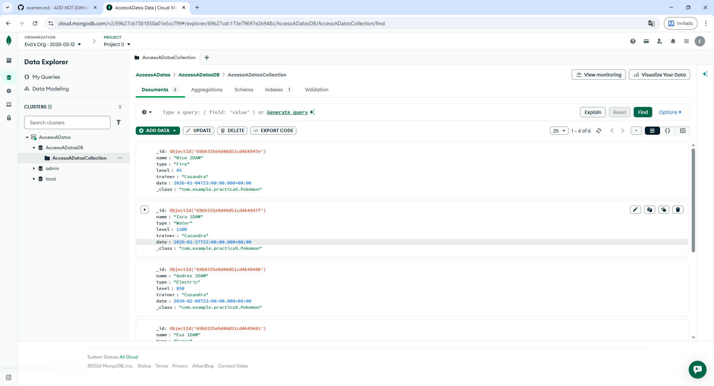
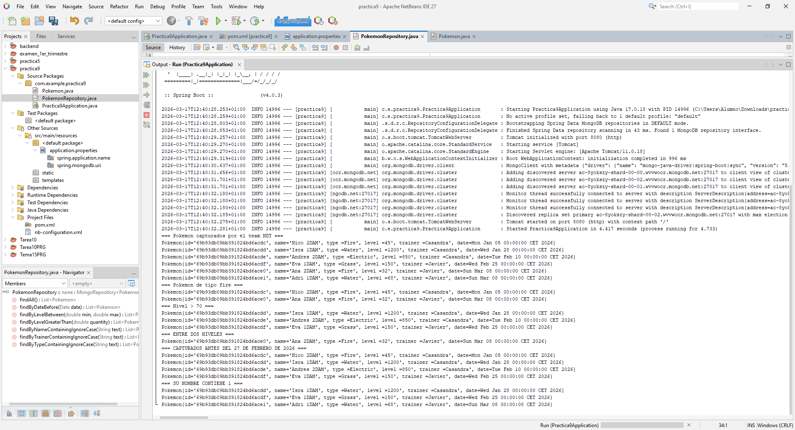
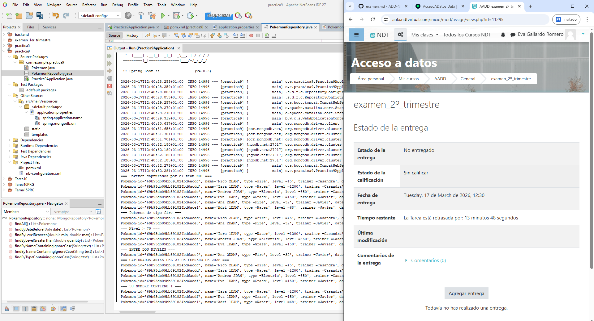

# Codigos examen practico

## Pokemon.java
```java
package com.example.practica9;

import org.springframework.data.annotation.Id;
import org.springframework.data.mongodb.core.mapping.Document;

import java.util.Date;

@Document(collection = "AccesoADatosCollection")
public class Pokemon {

    @Id
    private String id;

    private String name;
    private String type;
    private int level;
    private String trainer;
    private Date date;

    public Pokemon() {}

    public Pokemon(String id, String name, String type, int level, String trainer, Date date) {
        this.id = id;
        this.name = name;
        this.type = type;
        this.level = level;
        this.trainer = trainer;
        this.date = date;
    }

    public String getId() { return id; }

    public String getName() { return name; }

    public String getType() { return type; }

    public int getLevel() { return level; }

    public String getTrainer() { return trainer; }

    public Date getDate() { return date; }

    public void setId(String id) { this.id = id; }

    public void setName(String name) { this.name = name; }

    public void setType(String type) { this.type = type; }

    public void setLevel(int level) { this.level = level; }

    public void setTrainer(String trainer) { this.trainer = trainer; }

    public void setDate(Date date) { this.date = date; }

    
    
    @Override
    public String toString() {
        return "Pokemon{" +
                "id='" + id + '\'' +
                ", name='" + name + '\'' +
                ", type =" + type + '\'' +
                ", level =" + level + '\'' +
                ", trainer =" + trainer + '\'' +
                ", date=" + date +
                '}';
    }

}
```

## Practica9Application.java
```java
package com.example.practica9;

import org.springframework.boot.SpringApplication;
import org.springframework.boot.autoconfigure.SpringBootApplication;

import org.springframework.beans.factory.annotation.Autowired;
import org.springframework.boot.CommandLineRunner;

import java.util.Arrays;
import java.util.Date;
import java.util.List;
import org.springframework.data.domain.Sort;

@SpringBootApplication
public class Practica9Application implements CommandLineRunner {

    @Autowired
    private PokemonRepository repository;

    public static void main(String[] args) {
        SpringApplication.run(Practica9Application.class, args);
    }

    @Override
    public void run(String... args) throws Exception {

        // Borrar todos los datos
        repository.deleteAll();
        
        int level1 = 10;
        int level2 = 40;
        
        Date f1 = new Date(126, 0, 5);   // 5 enero 2026
        Date f2 = new Date(126, 0, 28);  // 28 enero 2026
        Date f3 = new Date(126, 1, 10);  // 10 febrero 2026
        Date f4 = new Date(126, 1, 25);  // 25 febrero 2026
        Date f5 = new Date(126, 2, 8);   // 8 marzo 2026 
        
        Date fechaLimite = new Date(126, 1, 27);   // 27 febrero 2026

        // Insertar datos de prueba
        List<Pokemon> lista = Arrays.asList(
                new Pokemon(null, "Nico 2DAM", "Fire", 45, "Casandra", f1),
                new Pokemon(null, "Isra 1DAM", "Water", 1200, "Casandra", f2),
                new Pokemon(null, "Andres 2DAM", "Electric", 850, "Casandra", f3),
                new Pokemon(null, "Eva 1DAM", "Grass", 150, "Javier", f4),
                new Pokemon(null, "Ana 2DAM", "Fire", 32, "Javier", f5),
                new Pokemon(null, "Adri 1DAM", "Water", 68, "Javier", f5)
        );

        repository.saveAll(lista);


        // Consultas
        System.out.println("=== Pokemon capturados por el team NDT ===");
        List<Pokemon> listaNDT = repository.findAll(Sort.by("id"));
        for(Pokemon pokemon : listaNDT){
            System.out.println(pokemon.toString());
        }
        
        System.out.println("=== Pokemon de tipo fire ===");
        repository.findByTypeContainingIgnoreCase("Fire").forEach(System.out::println);
        
        System.out.println("=== Nivel > 70 ===");
        repository.findByLevelGreaterThan(70).forEach(System.out::println);
        
        System.out.println("=== ENTRE DOS NIVELES ===");
        repository.findByLevelBetween(level1, level2).forEach(System.out::println);

        System.out.println("=== CAPTURADOS ANTES DEL 27 DE FEBRERO DE 2026 ===");
        repository.findByDateBefore(fechaLimite).forEach(System.out::println);
        
        System.out.println("=== SU NOMBRE CONTIENE 1 ===");
        repository.findByNameContainingIgnoreCase("1").forEach(System.out::println);

    }
}
```

## PokemonRepository.java
```
package com.example.practica9;

import org.springframework.data.mongodb.repository.MongoRepository;
import org.springframework.stereotype.Repository;

import java.util.Date;
import java.util.List;

@Repository
public interface PokemonRepository extends MongoRepository<Pokemon, String> {

    //Obtener pokemones capturados por el team NDT
    List<Pokemon> findAll();
    
    // Obtener pokemones de nivel mayor a una dada
    List<Pokemon> findByLevelGreaterThan(double quantity);
    
    // Obtener pokemones con nivel entre dos valores
    List<Pokemon> findByLevelBetween(double min, double max);
    
    //Obtener pokemones capturados por un entrenador (no utilizado)
    List<Pokemon> findByTrainerContainingIgnoreCase(String text);
    
    // Obtener todos los pokemones antes de una fecha
    List<Pokemon> findByDateBefore(Date date);
    
    //Obtener pokemones cuyo nombre contenga una palabra determinada
    List<Pokemon> findByNameContainingIgnoreCase(String text);
    
    //Obtener pokemones de un tipo determinado
    List<Pokemon> findByTypeContainingIgnoreCase(String text);
    
}
```



